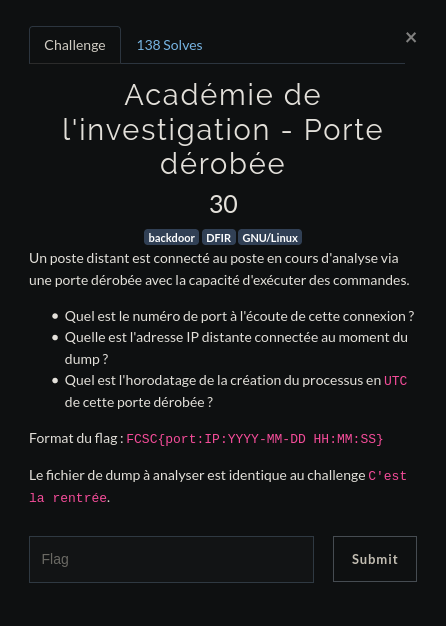

# Académmie de l'investigation - Porte dérobée

Donc on nous demande le numéro de port d'écoute , mhhh vous vous rappelez sur le challenge "Premiers Artéfacts" ? On devait cherché les connexions ESTABLISHED grâce à la commande netstat, et si on essayait de chercher les connexions LISTEN ?

    # python vol.py -f dmp.mem  --profile=Linuxdebian_5_4_0-4-amd64x64linux_netstat | grep LISTEN
    Volatility Foundation Volatility Framework 2.   6.1
    TCP      ::1             :   53     ::              :    0  LISTEN                    unbound/695  
    TCP      127.0.0.1       :   53 0.0.0.  0         :    0 LISTEN                       unbound/695  
    TCP      ::1             : 8953     ::              :    0  LISTEN                    unbound/695  
    TCP      127.0.0.1       : 8953 0.0.0.  0         :    0 LISTEN                       unbound/695  
    TCP      127.0.0.1       : 9050 0.0.0.  0         :    0  LISTEN                        tor/706  
    TCP      127.0.0.1       :   25 0.0.0.  0         :    0 LISTEN                       exim4/1048 
    TCP      ::1             :   25     ::              :    0  LISTEN                      exim4/1048 
    TCP      127.0.0.1       :64768 0.0.0.  0         :    0  LISTEN                        cli/119514
    TCP      127.0.0.1       :34243 0.0.0.  0         :    0  LISTEN                        cli/119514
    TCP      ::              :36280     ::              :    0  LISTEN                       ncat/119711
    TCP      0.0.0.0         :36280 0.0.0.  0         :    0 LISTEN                           ncat/119711

Bon ici on a beaucoup de truc :[, mais voilà on se doute bien que dans la cas d'une backdoor ici le port d'écoute serait plus le **36280 utilisé par netcat** que le 9050 utilisé par tor ;).

Bon maintenant essayons de trouver l'IP en sachant que nous avons déjà le port d'écoute. Ici personellement je n'ai rien su faire avec volatility :c mais hereusement qu'on a notre bonne vieille commande strings

    # strings dmp.mem | grep 36280
    NCAT_LOCAL_PORT=36280

Ok donc on voit que les paramètres apportés à netcat sont de la forme NCAT_PARAMÈTRE, essayons de grep le mot NCAT_ pour voir si l'IP a été mise en paramètre 

    root@PC:/home/saymant/Desktop/Bureau/FCSC/Forensic/CryptoLocker/volatility# strings dmp.mem | grep NCAT
    (SELECT GROUP_CONCAT(t_t.title, ',') FROM moz_bookmarks b_t JOIN    moz_bookmarks t_t ON t_t.id = +b_t.parent  WHERE b_t.fk = 
    NCAT_REMOTE_ADDR=fd:6663:7363:1000:55cf:b9c6:f41d:cc24
    NCAT_REMOTE_PORT=58014
    NCAT_LOCAL_ADDR=fd:6663:7363:1000:c10b:6374:25f:dc37
    NCAT_LOCAL_PORT=36280
    NCAT_PROTO=TCP

    ...

OK notre IP ici est **fd:6663:7363:1000:c10b:6374:25f:dc37**. Next ^^'

Maintenant cherchons l'heure de la création de la backdoor. On sait que le port est le port d'écoute est le 36280, cela veut donc dire que la backdoor se base sur ce port, essayons de voir quels processus sont associés à ce port

    # python vol.py -f dmp.mem --profile=Linuxdebian_5_4_0-4-amd64x64 linux_netstat | grep 36280
    Volatility Foundation Volatility Framework 2.6.1
    TCP         fd:6663:7363:1000:c10b:6374:25f:dc37:36280     fd:6663:7363:1000:55cf:b9c6:f41d:cc24:58014     ESTABLISHED                  ncat/1515 
    TCP         fd:6663:7363:1000:c10b:6374:25f:dc37:36280     fd:6663:7363:1000:55cf:b9c6:f41d:cc24:58014     ESTABLISHED                    sh/119511
    TCP      ::              :36280 ::                  :    0 LISTEN                       ncat/119711
    TCP      0.0.0.0         :36280 0.0.0.0             :    0 LISTEN                       ncat/119711

On peut alors voir que les processus ncat est lancé deux fois avec chacun comme PID 119711 & 1515 sont tout deux en train d'écouter sur ce port.

Essayons de lister les process en faisant un grep des PID 119711 & 1515

    # python vol.py -f dmp.mem --profile=Linuxdebian_5_4_0-4-amd64x64 linux_pslist | grep 119711
    Volatility Foundation Volatility Framework 2.6.1
    0xffff9d7284928000 ncat                     119711          119707          1001                1001   0x0000000007a54000 2020-03-26 23:36:52   UTC+0000

Rien de concluant ici, essayons maintenant avec l'autre PID

    # python vol.py -f dmp.mem --profile=Linuxdebian_5_4_0-4-amd64x64 linux_pslist | grep 1515
    Volatility Foundation Volatility Framework 2.6.1
    0xffff9d72c014be00 ncat                     1515            1513            1001                1001   0x000000003e3d0000 2020-03-26 23:24:20   UTC+0000
    0xffff9d72c5d50000 sh                       119511          1515            1001                1001   0x00000000128ac000 2020-03-26 23:32:36   UTC+0000

OK done, ici on a bien un ncat suivi d'un sh (utilisé par la backdoor pour pop un shell sur la machine) ce qui me semblent être les process appelés par la backdoor 0_o. Ce ncat a été appellé à **2020-03-26 23:24:20**

Finalement on devrait avoir un flag ressemblant à cela **FCSC{36280:fd:6663:7363:1000:c10b:6374:25f:dc37:2020-03-26 23:24:20}**