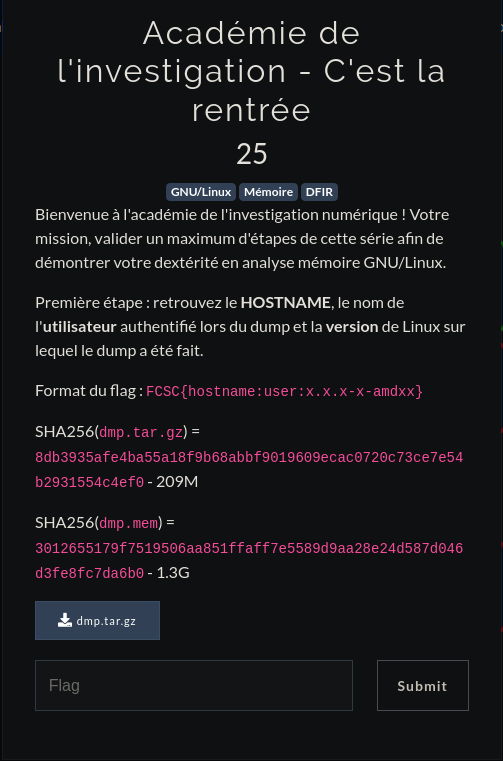

# <center>Académie de l'investigation - C'est la rentrée

<center>



</center>

Pour réaliser ce challenge, nous aurons juste besoin d'une bonne réflexion et des commandes strings et grep :)
<br><br>
On nous donne un dump en .dmp.
Premièrement pour et si on essayait d'avoir la version de Linux ? Comme je vous l'ai dit plus haut, on a qu'à faire ça :
   
    saymant@PC:~/Desktop/Bureau/FCSC/Write up/Forensic/Académie de l'investigation$ strings dmp.mem | grep "Linux version" | uniq
    Linux version 5.4.0-4-amd64 (debian-kernel@lists.debian.org) (gcc version 9.2.1 20200203 (Debian 9.2.1-28)) #1 SMP Debian 5.4.19-1 (2020-02-13)

Donc on sait déjà que la version de notre LInux est la 5.4.0-4-amd64, continuons.

Ensuite pour le hostname, on peut juste essayer un : 

    saymant@PC:~/Desktop/Bureau/FCSC/Write up/Forensic/Académie de l'investigation$ strings dmp.mem | grep hostname

Ce qui nous sort un grand nombre d'informations, dont une qui parraît intéressante : ```27 00:23:37 NetworkManager[636]: <info>  [1585265017.0294] hostname: hostname changed from (none) to "challenge.fcsc"```

On peut donc également en conclure que l'hostname est égal à "challenge.fcsc"

Bon pour finir cherchons l'user, on pourrait faire un ```strings dmp.mem | grep user```, mais rien de concluant n'était ressorti, donc on pourrait très bien essayer de jouer sur les PATH pour trouver l'user comme ci-dessous : 

    saymant@PC:~/Desktop/Bureau/FCSC/Write up/Forensic/Académie de l'investigation$ strings dmp.mem | grep "/home"
    HOME=/home/Lesage
    /home/Lesage/.config
    /home/Lesage/.config
    /home/Lesage/.cache
    /home/Lesage/.config/systemd/user.control
    /home/Lesage/.config/chromium/Default/Network   Action Predictor
    /home/Lesage/.config/chromium/Default/Shortcuts
    /home/Lesage
    ,:/home/LeA
    /home/Lesage
    /home/Lesage/.config/chromium/Default
    XAUTHORITY=/home/Lesage/.Xauthority
    cd /home/; treels /home/em
    /home/xxx/.bash_history
    ls -alh /home/*/.ssh/
    cat /home/*/.ssh/known_hosts
    grep ^telnet /home/*/.
    grep ^mysql /home/*/.
    cat /home/*/.mysql_history
    /home/*/.gnupg/secring.gpgs
    /h/Lomeesage
    /home/Lesage
    /home/Lesage
    /home/Lesage
    /home/Lesage/.local

Nous pouvons donc maintenant également affirmer que l'user se nomme Lesage.
