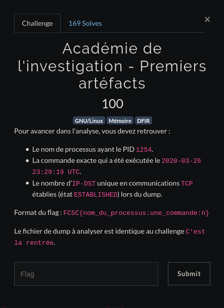

# <center>Académie de l'investigation - Premiers Artéfacts</center> 

<center>



</center>

Pour faire ce challenge, qui est la suite de [Académie de l'investigation - C'est la rentrée](https://github.com/saymant/Write-ups/tree/master/FCSC/Forensic/Acad%C3%A9mie%20de%20l'investigation/C'est%20la%20rentr%C3%A9e), il nous créer un profile volatility car non, malhereusement celui-ci n'est pas faisable uniquement à coups de strings. Trouver le profil les headers du kernel pour le profil a bien été éprouvant :(. 

Donc pour le créer il "suffit" de prendre [l'image système 5.4.0-4-amd64](https://cdn.discordapp.com/attachments/699728708591943771/707336377762840626/debian_5.4.0-4-amd64.zip)

Et faire les commandes ci-dessous

    $ cd volatility/tools/linux 
    $ make 

et finalement de mettre le .zip dans le répertoire /volatility/volatility/plugins/overlays/linux

Pour vérifier que notre profil est bien là on peut faire un 

    # python vol.py -f dmp.mem --info | grep debian
    Volatility Foundation Volatility Framework 2.6.1
    Linuxdebian_5_4_0-4-amd64x64 - A Profile for Linux  debian_5.4.0-4-amd64 x64

OK, donc on a bien notre profil et son nom, maintenant commençons à analyser notre dump. Faisons d'abord un ```linux_pslist``` pour voir si le programme avec le PID 1254 n'est juste pas dans la liste des process actifs

    # python vol.py -f dmp.mem --profile=Linuxdebian_5_4_0-4-amd64x64 linux_pslist
    Volatility Foundation Volatility Framework 2.6.1
    Offset             Name                 Pid                 PPid            Uid             Gid    DTB                Start Time
    ------------------ -------------------- ---------------     --------------- --------------- ------ ------------------ ----------
    0xffff9d72c6fb1f00 systemd              1                   0               0               0      0x00000000453b0000   2020-03-26 23:23:46 UTC+0000
    0xffff9d72c6fb4d80 kthreadd             2                   0               0               0      ------------------   2020-03-26 23:23:46 UTC+0000
    0xffff9d72c6fb6c80 rcu_gp               3                   2               0               0      ------------------   2020-03-26 23:23:46 UTC+0000
    0xffff9d72c6fb2e80 rcu_par_gp           4                   2               0               0      ------------------   2020-03-26 23:23:46 UTC+0000
    0xffff9d72c6fb0f80 kworker/0:0H         6                   2               0               0      ------------------

    ...

    0xffff9d72bf86ec80 at-spi-bus-laun      1242            1176            1001            1001   0x00000000407ee000 2020-03-26 23:24:13 UTC+0000
    0xffff9d72bf8d3e00 dbus-daemon          1247                1242            1001            1001   0x0000000040978000   2020-03-26 23:24:13 UTC+0000
    0xffff9d72bf868000 xfconfd              1251                1176            1001            1001   0x000000003f96e000   2020-03-26 23:24:13 UTC+0000
    0xffff9d72bf869f00 at-spi2-registr      1257                1176            1001            1001   0x000000003f9b8000   2020-03-26 23:24:13 UTC+0000
    0xffff9d72bf86be00 gpg-agent            1263                1176            1001            1001   0x0000000040c38000   2020-03-26 23:24:13 UTC+0000
    0xffff9d72bfc25d00 xfwm4                1265                1201            1001            1001   0x000000003facc000   2020-03-26 23:24:13 UTC+0000
    0xffff9d72bf86dd00 gvfsd                1268                1176            1001            1001   0x000000003faea000   2020-03-26 23:24:13 UTC+0000

On ne voit donc pas de programme ayant ce PID dans la liste des process actifs lors du dump :/.

Essayons de lister un peu le chercher dans toute l'étendue des process

    # python vol.py -f dmp.mem --profile=Linuxdebian_5_4_0-4-amd64x64 linux_psxview | grep 1254
    Volatility Foundation Volatility Framework 2.6.1
    INFO    : volatility.debug    : SLUB is currently unsupported.
    0x000000003fdccd80 pool-xfconfd           1254 False  True      False    False      False   False  

**pool-xfconfd**, OK next

La commande executée, il nous suffit de lister l'historique des commandes 

    # python vol.py -f dmp.mem --profile=Linuxdebian_5_4_0-4-amd64x64 linux_bash
    Volatility Foundation Volatility Framework 2.6.1
    Pid      Name                 Command Time                   Command
    -------- -------------------- ------------------------------ -------
        1523 bash                 2020-03-26 23:24:18 UTC+0000   rm .bash_history 
        1523 bash                 2020-03-26 23:24:18 UTC+0000   exit
        1523 bash                 2020-03-26 23:24:18 UTC+0000   vim /home/Lesage/. bash_history 
        1523 bash                 2020-03-26 23:24:27 UTC+0000   ss -laupt
        1523 bash                 2020-03-26 23:26:06 UTC+0000   rkhunter -c
        1523 bash                 2020-03-26 23:29:19 UTC+0000   nmap -sS -sV 10.   42.42.0/24
        1523 bash                 2020-03-26 23:31:31 UTC+0000   ?+??U
        1523 bash                 2020-03-26 23:31:31 UTC+0000   ip -c addr
        1523 bash                 2020-03-26 23:38:00 UTC+0000   swapoff -a
        1523 bash                 2020-03-26 23:38:05 UTC+0000   swapon -a
        1523 bash                 2020-03-26 23:40:18 UTC+0000   ls
        1523 bash                 2020-03-26 23:40:23 UTC+0000   cat LiME.txt 
        1523 bash                 2020-03-26 23:40:33 UTC+0000   cd LiME/src/
        1523 bash                 2020-03-26 23:40:54 UTC+0000   
        1523 bash                 2020-03-26 23:40:54 UTC+0000   insmod lime-5.4.   0-4-amd64.ko "path=/dmp.mem format=lime timeout=0"
    
On voit donc **2020-03-26 23:29:19 UTC+0000   nmap -sS -sV 10.42.42.0/24**, OK next.

Cherchons maintenant les connexions établies, testons de faire un netstat en ne prenant que les connexions établies 

    # python vol.py -f dmp.mem --profile=Linuxdebian_5_4_0-4-amd64x64 linux_netstat | grep ESTABLISHED
    Volatility Foundation Volatility Framework 2.6.1
    TCP      10.42.42.131    :36970 116.203.52.118  :  443 ESTABLISHED                   tor/706  
    TCP      10.42.42.131    :37252 163.172.182.147 :  443 ESTABLISHED                   tor/706  
    TCP      fd:6663:7363:1000:c10b:6374:25f:dc37:36280 fd:6663:7363:1000:55cf:b9c6:f41d:cc24:58014 ESTABLISHED                  ncat/1515 
    TCP      10.42.42.131    :47106 216.58.206.226  :  443 ESTABLISHED              chromium/119187
    TCP      10.42.42.131    :55224 151.101.121.140 :  443 ESTABLISHED              chromium/119187
    TCP      10.42.42.131    :55226 151.101.121.140 :  443 ESTABLISHED              chromium/119187
    TCP      10.42.42.131    :53190 104.124.192.89  :  443 ESTABLISHED              chromium/119187
    TCP      10.42.42.131    :45652 35.190.72.21    :  443 ESTABLISHED              chromium/119187
    TCP      10.42.42.131    :47102 216.58.206.226  :  443 ESTABLISHED              chromium/119187
    TCP      10.42.42.131    :47104 216.58.206.226  :  443 ESTABLISHED              chromium/119187
    TCP      10.42.42.131    :38186 216.58.213.142  :  443 ESTABLISHED              chromium/119187
    TCP      10.42.42.131    :47100 216.58.206.226  :  443 ESTABLISHED              chromium/119187
    TCP      10.42.42.131    :50612 104.93.255.199  :  443 ESTABLISHED              chromium/119187
    TCP      10.42.42.131    :58772 185.199.111.154 :  443 ESTABLISHED              chromium/119187
    TCP      10.42.42.131    :38184 216.58.213.142  :  443 ESTABLISHED              chromium/119187
    TCP      10.42.42.131    :57000 10.42.42.134    :   22 ESTABLISHED                   ssh/119468
    TCP      fd:6663:7363:1000:c10b:6374:25f:dc37:36280 fd:6663:7363:1000:55cf:b9c6:f41d:cc24:58014 ESTABLISHED                    sh/119511
    TCP      127.0.0.1       :38498 127.0.0.1       :34243 ESTABLISHED                   cli/119514
    TCP      127.0.0.1       :34243 127.0.0.1       :38498 ESTABLISHED                   cli/119514
    TCP      10.42.42.131    :51858 10.42.42.128    :  445 ESTABLISHED             smbclient/119577

OK, on a nos connexions, mais il y a tout de même beaucoup de connexions se ressemblants, clarifions un peu tout ça

    # python vol.py -f dmp.mem --profile=Linuxdebian_5_4_0-4-amd64x64 linux_netstat | grep ESTABLISHED | sort -u -k4,4
    Volatility Foundation Volatility Framework 2.6.1
    TCP      10.42.42.131    :53190 104.124.192.89  :  443 ESTABLISHED              chromium/119187
    TCP      10.42.42.131    :51858 10.42.42.128    :  445 ESTABLISHED             smbclient/119577
    TCP      10.42.42.131    :57000 10.42.42.134    :   22 ESTABLISHED                   ssh/119468
    TCP      10.42.42.131    :50612 104.93.255.199  :  443 ESTABLISHED              chromium/119187
    TCP      10.42.42.131    :36970 116.203.52.118  :  443 ESTABLISHED                   tor/706  
    TCP      127.0.0.1       :38498 127.0.0.1       :34243 ESTABLISHED                   cli/119514
    TCP      10.42.42.131    :55224 151.101.121.140 :  443 ESTABLISHED              chromium/119187
    TCP      10.42.42.131    :37252 163.172.182.147 :  443 ESTABLISHED                   tor/706  
    TCP      10.42.42.131    :58772 185.199.111.154 :  443 ESTABLISHED              chromium/119187
    TCP      10.42.42.131    :47106 216.58.206.226  :  443 ESTABLISHED              chromium/119187
    TCP      10.42.42.131    :38186 216.58.213.142  :  443 ESTABLISHED              chromium/119187
    TCP      10.42.42.131    :45652 35.190.72.21    :  443 ESTABLISHED              chromium/119187
    TCP      fd:6663:7363:1000:c10b:6374:25f:dc37:36280 fd:6663:7363:1000:55cf:b9c6:f41d:cc24:58014 ESTABLISHED  
Ça a déjà l'air un peu plus clair, on nous demande un nombre, so comptons tout ça

    # python vol.py -f dmp.mem --profile=Linuxdebian_5_4_0-4-amd64x64 linux_netstat | grep ESTABLISHED | sort -u -k4,4 | wc -l
    Volatility Foundation Volatility Framework 2.6.1
    13

OK, on a donc **13 connexions établies**.

Ce qui le tout réuni nous donnerait au final un flag comme **FCSC{pool-xfconfd:nmap -sS -sV 10.42.42.0/24:13}**
