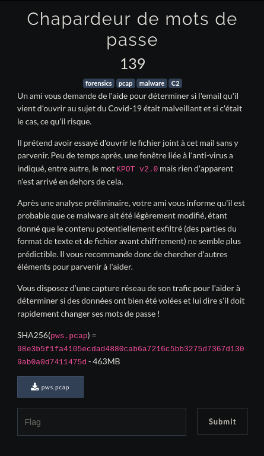
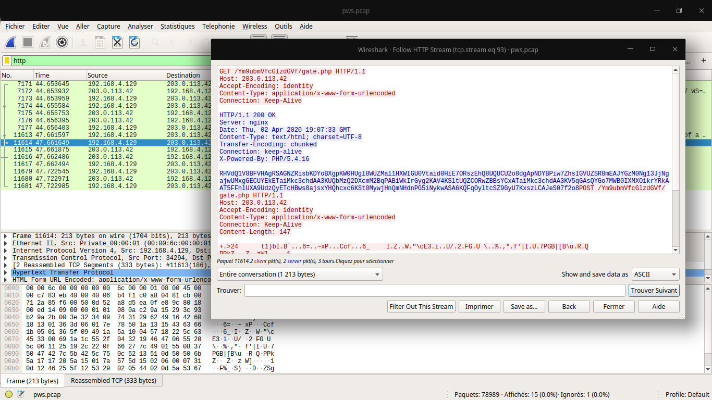
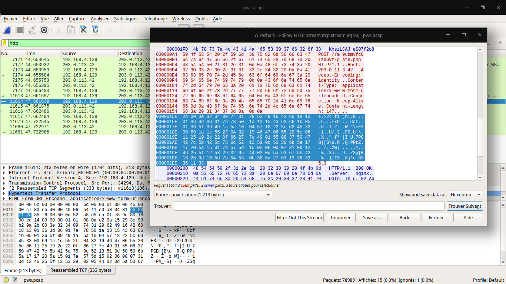

# Chapardeur de mots de passe



Tout d'abord avant de commencer le challenge, en lisant l'énoncé on peut se douter qu'il s'agit du malware KPOT v2.0 donc je suis aussitôt parti me renseigner sur ce malware sur des sites comme : https://www.proofpoint.com/us/threat-insight/post/new-kpot-v20-stealer-brings-zero-persistence-and-memory-features-silently-steal


Donc on ouvre le .pcap avec Wireshark et on sait déjà que les requêtes vers le C&C se font via une page host/lettresrandom/gate.php, donc on va filtrer les packets en ne mettant que les requêtes http.

Dans celle-ci on trouve des requêtes vers /Ym9ubmVfcGlzdGVf/gate.php, dont une en POST. On regarde alors le HTTP Stream



On voit qu'une requête GET dont le contenu est en base64 a été send avant la POST, déchiffrons alors cela.

    $ echo RHVdQ1V8BFVHAgRSAGNZRisbKDYoBXgpKW0HUgl8WUZMal1HXWIGU0Vtaid0HiE7ORszEhQ8UQUCU2o8dgApNDYBPiw7ZhsIGVUZSR8mEAJYGzM0Ng13JjNgajwUMxgGECUYEkETaiMkc3chdAA3KUQbMzQ2DXcmM2BqPABiWkIrGyg2KAV4KSltUQZCORwZBBsYCxATaiMkc3chdAA3KV5qGAsQYGo7MWB0IXMXOikrYRkAAT5FFhlUXA9UdzQyETcHBws8ajsxYHQhcxc6KSt0MywjHnQmNHdnPG5iNykwASA6KQFqOyltcSZ9GyU7KxszLCAJeS07f2o8 | base64 -d
    w&3`j<bZB+(6(x))mQB9346	|YFLj]G]    bSEmj't!;93<QSj<v)46>,;fUI&X346
                               j#$sw!t7)^j
                                             `j;   1`t!s  :)   +a>  ET\ Tw42    7
                                                                           <j;1`t!s:)+t3,#t&    4wg<nb7)0 :)j;)mq&}%;+3, 	y-;j<

                                        
Bon pas vraiment clair tout ça ... Mettons l'output dans un fichier. En connaissance du malware, on peut d'avance dire que le chiffrement est en XOR, il ne nous reste plus qu'à trouver la key maintenant :/. Boh ça doit pas être bien dur, on connaît la forme globale de la requête 

    1111111111111100__DELIMM__A.B.C.D__DELIMM__appdata__GRABBER__*.log,*.txt,__GRABBER__%appdata%__GRABBER__0__GRABBER__1024__DELIMM__desktop_txt__GRABBER__*.txt,__GRABBER__%userprofile%\Desktop__GRABBER__0__GRABBER__150__DELIMM____DELIMM____DELIMM__

On peut alors trouver la key via la méthode d'attaque par clair connu. J'ai ici utilisé un script que j'ai trouvé sur internet :

```python

    #!/usr/bin/env python2
    # Author: Alamot
    # This is a XOR plaintext attack tool: If we    know a part of the plaintext maybe
    # we can recover the key and the whole text.
    from __future__ import print_function
    from __future__ import division
    import string, sys


    ignore_code = 0xff
    printable_key = True
    max_key_length = 21


    def is_printable(text, ignore_code):
        ''' Function to check if every character    in text is printable '''
        for ch in text:
            if ord(ch) == ignore_code:
                continue
            if ch not in string.printable:
                return False
        return True


    def lrotate(s, d):
        ''' Function to rotate string left by d     length '''
        return s[d:] + s[0:d]


    if len(sys.argv) < 2 or sys.argv[1].strip().    lower() == "--help":
        print("Known-plaintext attack:\n"+sys.argv  [0]+" <encrypted file> <known plaintext>  [max_key_length]")
        print("\nDecrypt using known key:\n"+sys.   argv[0]+" <encrypted file>     --key=the_known_key")
        exit()

    filename = sys.argv[1]

    if sys.argv[2].strip().lower()[:5] == "--key":
        known_key = sys.argv[2].strip()[6:]
        with open(filename, "rb") as f:
            data = f.read()
        decrypted_text = ""
        repeated_key = (known_key)*((len(data) //   len(known_key)) + 1)
        for x in range(len(data)):
            decrypted_text += chr(ord(data[x]) ^    ord(repeated_key[x]))
        print("Key length: "+str(len(known_key)),   "\nPartial Key: "+known_key,  "\nPlaintext: "+decrypted_text)
        exit()
    else:
        known_plaintext = sys.argv[2]

    if len(known_plaintext) > max_key_length:
        print("The length of the known plaintext    is greater than max_key_length (="+str (max_key_length)+"). Please give a   smaller plaintext or incrase  max_key_length.")
        exit()

    if len(sys.argv) > 3:
        max_key_length = int(sys.argv[3])+1

    with open(filename, "rb") as f:
        data = f.read()

    print("Searching XOR-encrypted "+filename+"     for string '"+known_plaintext+"'    (max_key_length = "+str(max_key_length-1)+")")

    try:    
        for i in range(len(data)-len    (known_plaintext)): # Try known plaintext   in every position
            partial_key = ""
            for j in range(len(known_plaintext)):
                if known_plaintext[j] ==    ignore_code:
                    partial_key += chr  (ignore_code)
                else:
                    partial_key += chr(ord(data[i   +j]) ^ ord(known_plaintext[j]) )
            #print("Single key: "+partial_key)
            if is_printable(partial_key,    ignore_code) or not printable_key:
                for n in range(len(partial_key),    max_key_length): # Try different   key lengths
                    for m in range(n)   :                              # Try different partial key   positions
                        expanded_key = lrotate  (partial_key+chr  (ignore_code)*(n-len  (partial_key)), m)
                        #print(expanded_key, m)
                        repeated_key =  (expanded_key)*((len (data) // len    (expanded_key)) + 1)
                        decrypted_text = ""
                        for x in range(len(data))   : # Try to decrypt the     encoded text
                            if ord(repeated_key[x]  ) == ignore_code:
                                decrypted_text +=   chr(ignore_code)
                            else:
                                decrypted_text +=   chr(ord(data[x])  ^ ord(repeated_key   [x]))
                        if is_printable (decrypted_text,     ignore_code): # Is the  whole result printable?
                            if known_plaintext in   decrypted_text:
                                print("Key  length: "+str(len    (expanded_key)),    "\nPartial Key: "  +expanded_key,    "\nPlaintext: "    +decrypted_text)
                                print("")
    except KeyboardInterrupt:
        print("\nCtrl+C received. Exiting...")
        exit()
```

Plus qu'à l'executer

    $ python xorknown.py xored_file %appdata%
    Searching XOR-encrypted xored_file for string   '%appdata%' (max_key_length = 20)
    Key length: 16 
    Partial Key: tDlsd�������1Rhv 
    Plaintext: 01101�������1110__DEL�������8.108.   149�������ELIMM__ap�������GRABBER__�������.    txt,    __GR�������%appdata%�������ER__0__GR�������102  4__DEL�������sktop_txt�������ER__*.   txt�������BER__%use�������e%\Deskto�������BER_ _0__G�������_0__DELIM�������LIMM____D�������

On a ici un bout de la key

    saymant@PC:~/Desktop/Bureau/FCSC/Forensic/Chapardeur des mots de passe$ python xorknown.py xored_file %userprofile%
    Searching XOR-encrypted xored_file for string   '%userprofile%' (max_key_length = 20)
    Key length: 16 
    Partial Key: �DlsdL5dv25c1R�� 
    Plaintext: �1101011101111���_DELIMM__218.���.149.   373__DEL���__appdata__GR���ER__*.log,*.    t���__GRABBER__%a���ata%__GRABBER���__GRABBER__10���_DELIMM __desk���_txt__GRABBER���.txt,   __GRABBE���%userprofile%���sktop__GRABBE���0__GRABBER__0���    ELIMM____DELI���___DELIMM__

Et ici un autre bout, super ce qui nous donne comme clé finale **tDlsdL5dv25c1Rhv** !

La requête dechiffrée se présente comme ceci si vous la vouliez :

    0110101110111110__DELIMM__218.108.149.373__DELIMM__appdata__GRABBER__*.log,*.txt,__GRABBER__%appdata%__GRABBER__0__GRABBER__1024__DELIMM__desktop_txt__GRABBER__*.txt,__GRABBER__%userprofile%\Desktop__GRABBER__0__GRABBER__0__DELIMM____DELIMM____DELIMM__

\_\_DELIMM__ : délimite les champs
<br>
218.108.149.373 : IP de la victime
<br>
\_\_GRABBER__ :quels files le malware va chercher et exfiltrer

Bien maintenant il ne nous reste plus qu'à récuperer le flag en chiffrant le contenu de requête POST avec notre clé. On va d'abord prendre le contenu de la requête en Hex dump car certains caractères ne passent pas en ASCII sur Wireshark.



Ce qui en un peu plus propre nous donne ```\x2b\x00\x3e\x32\x34\x09\x74\x31\x29\x62\x49\x16\x42\x60\x18\x13\x01\x36\x3d\x06\x01\x7e\x78\x50\x1a\x13\x15\x43\x63\x66\x1b\x05\x01\x36\x5f\x09\x49\x1a\x5a\x10\x04\x57\x18\x22\x5c\x63\x45\x33\x00\x69\x1a\x1c\x55\x2f\x04\x32\x19\x46\x47\x06\x55\x20\x5c\x06\x11\x25\x19\x2c\x22\x0f\x66\x27\x7c\x49\x01\x55\x08\x37\x50\x47\x42\x7c\x5b\x42\x5c\x75\x0c\x52\x13\x51\x0d\x50\x50\x6b\x5a\x17\x17\x20\x5a\x15\x01\x7a\x57\x5d\x15\x02\x06\x00\x07\x31\x0d\x12\x46\x25\x5f\x12\x53\x29\x02\x05\x44\x02\x0d\x5a\x53\x67\x5b\x42\x16\x25\x0d\x16\x5d\x7b\x54\x53\x0b\x38\x6a\x27\x63\x13\x38\x33\x35\x11\x33```

Plus qu'à chiffrer le tout

```python
    $ python
    Python 2.7.13 (default, Sep 26 2018, 18:42:22) 
    [GCC 6.3.0 20170516] on linux2
    Type "help", "copyright", "credits" or "license" for more   information.
    >>> tab = ''
    >>> x  =    '\x2b\x00\x3e\x32\x34\x09\x74\x31\x29\x62\x49\x16\x42\x60\x    18\x13\x01\x36\x3d\x06\x01\x7e\x78\x50\x1a\x13\x15\x43\x63\ x66\x1b\x05\x01\x36\x5f\x09\x49\x1a\x5a\x10\x04\x57\x18\x22  \x5c\x63\x45\x33\x00\x69\x1a\x1c\x55\x2f\x04\x32\x19\x46\x4   7\x06\x55\x20\x5c\x06\x11\x25\x19\x2c\x22\x0f\x66\x27\x7c\x    49\x01\x55\x08\x37\x50\x47\x42\x7c\x5b\x42\x5c\x75\x0c\x52\ x13\x51\x0d\x50\x50\x6b\x5a\x17\x17\x20\x5a\x15\x01\x7a\x57  \x5d\x15\x02\x06\x00\x07\x31\x0d\x12\x46\x25\x5f\x12\x53\x2   9\x02\x05\x44\x02\x0d\x5a\x53\x67\x5b\x42\x16\x25\x0d\x16\x    5d\x7b\x54\x53\x0b\x38\x6a\x27\x63\x13\x38\x33\x35\x11\x33'
    >>> y = 'tDlsdL5dv25c1Rhv' * 10
    >>> for i in range(len(x)):
    ...     tab += chr(ord(x[i]) ^ ord(y[i]))
    ... 
    >>> print tab
    _DRAPEAU_P|us2peurQue2M4l!      R4ssur3z-Votre-Am1-Et-vo1c1Votredr4peau_FCSC
    {469e8168718996ec83a92acd6fe6b9c03c6ced2a3a7e7a2089b534baae 97a7}
    _DRAPEAU_
    >>> quit()
```

Ah !  Eh bien on a eu notre flag plus tôt que prévu ^^'