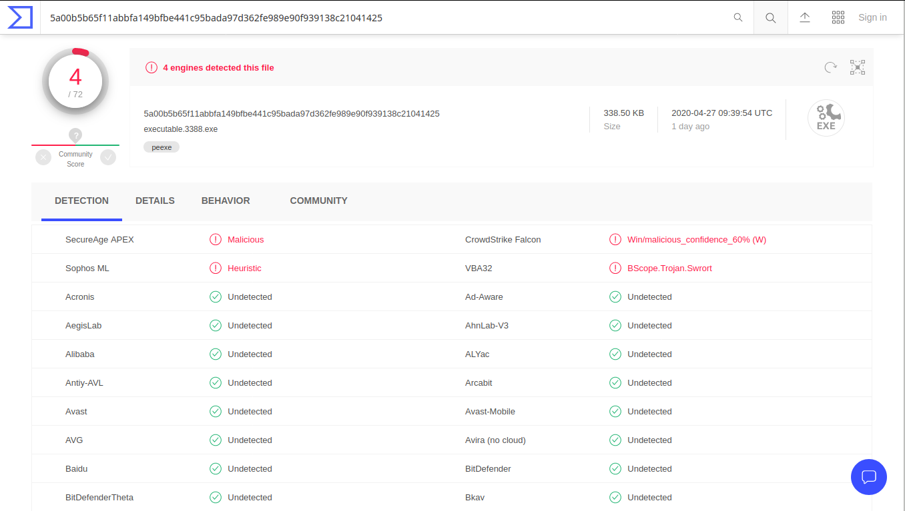
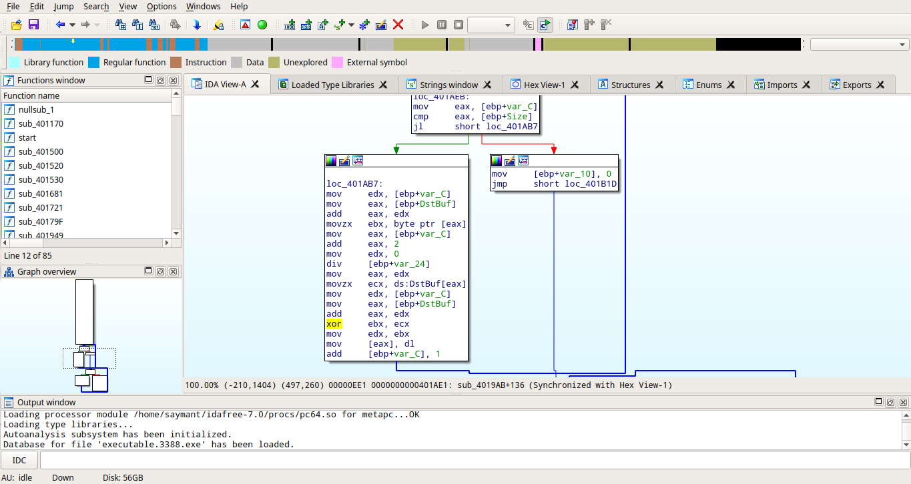

# <center>CryptoLocker</center>

<blockquote> Un de nos admins nous a appelé en urgence suite à un CryptoLocker qui s'est lancé sur un serveur ultra-sensible, juste après avoir appliqué une mise à jour fournie par notre prestataire informatique.

Ce malware vise spécifiquement un fichier pouvant faire perdre des millions d'euros à notre entreprise : il est très important de le retrouver !

L'administrateur nous a dit que pour éviter que le logiciel ne se propage, il a mis en pause le serveur virtualisé et a récupéré sa mémoire vive dès qu'il a détecté l'attaque.

Vous êtes notre seul espoir.</blockquote>

Nous sommes donc en possésions d'un fichier *memory.dmp*.
<br>
Premièrement, à l'aide de [Volatility]('https://github.com/volatilityfoundation/volatility') essayons de récuperer des informations globales sur le fichier dump.

```volatility -f memory.dmp imageinfo```

        Volatility Foundation Volatility Framework 2.6
    INFO    : volatility.debug    : Determining profile based on KDBG search...
            Suggested Profile(s) : Win7SP1x86_23418, Win7SP0x86, Win7SP1x86 (Instantiated with WinXPSP2x86)
                        AS Layer1 : IA32PagedMemoryPae (Kernel AS)
                        AS Layer2 :            WindowsCrashDumpSpace32 (Unnamed AS)
                        AS Layer3 : FileAddressSpace (/home/saymant/Desktop/Bureau/FCSC/Forensic/CryptoLocker/memory.dmp)
                        PAE type : PAE
                            DTB : 0x185000L
                KUSER_SHARED_DATA : 0xffdf0000L
            Image date and time : 2020-04-13 18:39:35 UTC+0000
        Image local date and time : 2020-04-13 11:39:35 -0700

On peut alors voir qu'ici 3 profiles se présentent à nous.
Essayons en-un (Win7SP1x86). On va alors essayer de suivre ceci de la commande ```pstree``` qui va tout simplement lister les processus qui étaient en cours lors du dump sous forme d'arborescence.
<br>
<br>
```volatility -f memory.dmp --profile=Win7SP1x86 pstree```

        Name                                                  Pid   PPid   Thds   Hnds Time
    -------------------------------------------------- ------ ------ ------ ------ ----
    0x84bfe318:wininit.exe                               412    332      3     77 2020-04-13 18:37:05 UTC+0000
    . 0x84f37030:services.exe                             484    412      9    232 2020-04-13 18:37:06 UTC+0000
    .. 0x855dd030:svchost.exe                            2880    484     12    258 2020-04-13 18:39:32 UTC+0000
    .. 0x85083d28:svchost.exe                            1388    484     20    319 2020-04-13 18:37:17 UTC+0000
    .. 0x855afbf0:msdtc.exe                              3216    484     15    154 2020-04-13 18:37:57 UTC+0000
    .. 0x84f76d28:svchost.exe                             664    484      7    284 2020-04-13 18:37:09 UTC+0000
    .. 0x850e4908:svchost.exe                            1556    484     13    328 2020-04-13 18:37:19 UTC+0000
    .. 0x84f9a648:VSSVC.exe                              3564    484      7    117 2020-04-13 18:38:02 UTC+0000
    .. 0x852e8638:wmpnetwk.exe                           2464    484     11    213 2020-04-13 18:37:38 UTC+0000
    .. 0x85234880:sppsvc.exe                             1884    484      4    164 2020-04-13 18:37:34 UTC+0000
    .. 0x8528f030:svchost.exe                            2220    484      5    102 2020-04-13 18:37:37 UTC+0000
    .. 0x850e7470:svchost.exe                            1584    484     13    224 2020-04-13 18:37:19 UTC+0000
    .. 0x851cd6c8:vmtoolsd.exe                            264    484      9    309 2020-04-13 18:37:28 UTC+0000
    .. 0x83f15d28:taskhost.exe                           1332    484     11    215 2020-04-13 18:37:17 UTC+0000
    .. 0x85078be8:WmiApSrv.exe                           3616    484      6    126 2020-04-13 18:38:03 UTC+0000
    .. 0x83fa6bf8:svchost.exe                             952    484      6    120 2020-04-13 18:37:12 UTC+0000
    .. 0x84fb19b0:svchost.exe                             820    484     19    384 2020-04-13 18:37:11 UTC+0000
    ... 0x8507db48:dwm.exe                               1360    820      4     69 2020-04-13 18:37:17 UTC+0000
    .. 0x85291680:dllhost.exe                            2240    484     20    200 2020-04-13 18:37:37 UTC+0000
    .. 0x8521fd28:SearchIndexer.                         1788    484     12    581 2020-04-13 18:37:32 UTC+0000
    ... 0x852a2030:SearchFilterHo                        3068   1788      4     79 2020-04-13 18:37:45 UTC+0000
    ... 0x8535b030:SearchProtocol                        3024   1788      7    269 2020-04-13 18:37:45 UTC+0000
    .. 0x85015d28:svchost.exe                            1096    484     22    582 2020-04-13 18:37:14 UTC+0000
    .. 0x84fb6d28:svchost.exe                             844    484     17    594 2020-04-13 18:37:11 UTC+0000
    .. 0x84fba790:svchost.exe                             868    484     41   1014 2020-04-13 18:37:11 UTC+0000
    .. 0x851a7c98:VGAuthService.                         1972    484      4     87 2020-04-13 18:37:26 UTC+0000
    .. 0x85063030:spoolsv.exe                            1244    484     14    275 2020-04-13 18:37:16 UTC+0000
    .. 0x85140030:cygrunsrv.exe                          1760    484      6    101 2020-04-13 18:37:22 UTC+0000
    ... 0x83deb4f8:cygrunsrv.exe                         1876   1760      0 ------ 2020-04-13 18:37:24 UTC+0000
    .... 0x85199d28:sshd.exe                             1928   1876      4    100 2020-04-13 18:37:25 UTC+0000
    .. 0x84f6bbb8:svchost.exe                             592    484     11    363 2020-04-13 18:37:09 UTC+0000
    ... 0x85536548:WmiPrvSE.exe                          3168    592     15    317 2020-04-13 18:37:55 UTC+0000
    ... 0x85252a60:WmiPrvSE.exe                          2156    592     10    194 2020-04-13 18:37:37 UTC+0000
    .. 0x8519e030:dllhost.exe                            2548    484     18    202 2020-04-13 18:37:41 UTC+0000
    .. 0x84fa6030:svchost.exe                             764    484     21    438 2020-04-13 18:37:10 UTC+0000
    . 0x84f3ba30:lsass.exe                                492    412      7    620 2020-04-13 18:37:06 UTC+0000
    . 0x84f3da70:lsm.exe                                  500    412     10    198 2020-04-13 18:37:06 UTC+0000
    0x84bc64d0:csrss.exe                                 340    332      8    562 2020-04-13 18:37:04 UTC+0000
    . 0x8518ed28:conhost.exe                             1904    340      2     32 2020-04-13 18:37:25 UTC+0000
    0x83d38ad0:System                                      4      0     89    526 2020-04-13 18:36:59 UTC+0000
    . 0x844f8d28:smss.exe                                 248      4      2     29 2020-04-13 18:36:59 UTC+0000
    0x85093c90:explorer.exe                             1432   1320     28    756 2020-04-13 18:37:17 UTC+0000
    . 0x855f6b10:DumpIt.exe                              2208   1432      6     91 2020-04-13 18:39:30 UTC+0000
    . 0x851b1d28:vmtoolsd.exe                            1980   1432      7    141 2020-04-13 18:37:26 UTC+0000
    . 0x83de43a8:update_v0.5.exe                          3388   1432      2     61 2020-04-13 18:38:00 UTC+0000
    0x84f0bd28:winlogon.exe                              424    372      4    109 2020-04-13 18:37:05 UTC+0000
    0x84bfa030:csrss.exe                                 380    372     10    219 2020-04-13 18:37:05 UTC+0000
    . 0x851fc750:conhost.exe                             2028    380      2     34 2020-04-13 18:39:30 UTC+0000
    . 0x8548e5d0:conhost.exe                             3428    380      2     33 2020-04-13 18:38:00 UTC+0000

Après avoir jeté un petit coup d'oeil on peut très vite s'apercevoir que presque tous les processus sont des processus Windows, mis à part 2 : DumpIt.exe et update_v0.5.exe.
Mhh... Assez louche tout ça, ces deux executables sont des processus enfants du explorer.exe qui a comme PID 1432.
On va alors une fois jeter un coup d'oeil au niveau de ce qu'il s'est passé dans l'invite de commande, à l'aide du paramètre ```consoles```.

```volatility -f memory.dmp --profile=Win7SP1x86 consoles```

    Volatility Foundation Volatility Framework 2.6
    **************************************************
        ConsoleProcess: conhost.exe Pid: 1904
        tle: C:\Program Files\OpenSSH\bin\cygrunsrv.exe
    AttachedProcess: sshd.exe Pid: 1928 Handle: 0x54
    ----
    CommandHistory: 0x200960 Application: sshd.exe Flags: Allocated
    CommandCount: 0 LastAdded: -1 LastDisplayed: -1
    FirstCommand: 0 CommandCountMax: 50
    ProcessHandle: 0x54
    ----
    CommandHistory: 0x2007f0 Application: cygrunsrv.exe Flags: 
    CommandCount: 0 LastAdded: -1 LastDisplayed: -1
    FirstCommand: 0 CommandCountMax: 50
    ProcessHandle: 0x0
    ----
    Screen 0x2160a8 X:80 Y:300
    Dump:

    **************************************************
    ConsoleProcess: conhost.exe Pid: 3428
    Console: 0xbe81c0 CommandHistorySize: 50
    HistoryBufferCount: 1 HistoryBufferMax: 4
    OriginalTitle: C:\Users\IEUser\Desktop\update_v0.5.exe
    Title: C:\Users\IEUser\Desktop\update_v0.5.exe
    AttachedProcess: update_v0.5.ex Pid: 3388 Handle: 0x5c
    ----
    CommandHistory: 0x309a78 Application: update_v0.5.exe Flags: Allocated
    CommandCount: 0 LastAdded: -1 LastDisplayed: -1
    FirstCommand: 0 CommandCountMax: 50
    ProcessHandle: 0x5c
    ----
    Screen 0x2f60a0 X:80 Y:300
    Dump:
            ENCRYPTOR v0.   5                                                          

    [info] entering the folder : .  /                                                 
    [info] file encryptable found : ./flag. txt                                      

    ****Chiffrement termin??e ! Envoyez l'argent    !                                  
    **************************************************
    ConsoleProcess: conhost.exe Pid: 2028
    Console: 0xbe81c0 CommandHistorySize: 50
    HistoryBufferCount: 1 HistoryBufferMax: 4
    OriginalTitle: C:\Users\IEUser\Desktop\DumpIt.exe
    Title: C:\Users\IEUser\Desktop\DumpIt.exe
    AttachedProcess: DumpIt.exe Pid: 2208 Handle: 0x5c
    ----
    CommandHistory: 0x44a9d8 Application: DumpIt.exe Flags: Allocated
    CommandCount: 0 LastAdded: -1 LastDisplayed: -1
    FirstCommand: 0 CommandCountMax: 50
    ProcessHandle: 0x5c
    ----
    Screen 0x4360a0 X:80 Y:300
    Dump:

      DumpIt 3.0.20200224.1 (X86) (Feb 24   2020)                                     
      Copyright (C) 2007 - 2020, Matt Suiche    (msuiche)                              
      Copyright (C) 2016 - 2020, Comae Technologies DMCC <https://www.comae.    com>    
      All rights    reserved.                                                          

      DumpIt is the best for acquisition but... our platform Stardust is also the   be
    st for  analysis!                                                                
      Access it on https://my.comae.com - info@comae.com if you have any    questions. 

        Destination path:           \?? \C:\Users\IEUser\Desktop\IEWIN7-20200413-1839
    30. dmp                                                                          

        Computer name:                  IEWIN7                                          


        --> Proceed with the acquisition ? [y/n]    y                                  

        [+]     Information:                                                            
        Dump Type:                   Microsoft Crash    Dump                           


        [+] Machine     Information:                                                    
        Windows version:             6.1.   7601                                       
        MachineId:                      88C74D56-863E-C3A6-B91E-C1719B06467C           
        TimeStamp:                      132312767754375000                             
        Cr3:                            0x185000                                       
        KdDebuggerData:                 0x8273ac78                                     

        Current date/time:          [2020-04-13 (YYYY-MM-DD) 18:39:35 (UTC) ]        
        + Processing..  .                                                             


Ici on remarque alors que DumpIt.exe n'était en fait que notre permettant de transférer de l'argent. De plus dans l'énoncé il est dit que le CryptoLocker s'est lancé juste après qu'une mise à jour ait été faite, donc tout porte à croire qu'il faudrait plus se pencher sur le update_v0.5.exe.
<br>
On essaye donc de le dump et de voir ce qu'il se cache derrière cet executable.
Pour dump l'executable nous allons utiliser la commande : 
<br>

```volatility -f memory.dmp --profile=Win7SP1x86 procdump -p 3388 --dump-dir=.```

    Volatility Foundation Volatility Framework 2.6
    Process(V) ImageBase  Name                 Result
    ---------- ---------- -------------------- ------
    0x83de43a8 0x00400000 update_v0.5.ex       OK: executable.3388.exe

Bien essayons maintenant d'analyser cet executable avec un outil assez 



On ne trouve rien de bien intéressant pour l'instant sur cet executable ... Revenons en alors au dump, nous n'avons sûrement pas fini d'en exploiter son potentiel.
<br>

Cherchons alors dans les MFT (Master File Tables) pour voir si il n'y a rien d'intéressant.

En trifouillant un peu à l'aide du paramètre ```ftparser``` on arrive finalement à trouver 2 fichiers plus ou moins intéressants :
<br><br>
```volatility -f memory.dmp --profile=Win7SP1x86 mftparser | grep flag```

    Volatility Foundation Volatility Framework 2.6
    2020-04-13 18:38:01 UTC+0000 2020-04-13 18:38:01 UTC+0000   2020-04-13 18:38:01 UTC+0000   2020-04-13 18:38:01 UTC+0000   Users\IEUser\Desktop\flag.txt.enc

<br>

```volatility -f memory.dmp --profile=Win7SP1x86 mftparser | grep key```

    Volatility Foundation Volatility Framework 2.6
    2020-04-13 18:37:54 UTC+0000 2020-04-13 18:37:54 UTC+0000   2020-04-13 18:37:54 UTC+0000   2020-04-13 18:37:54 UTC+0000   Users\IEUser\Desktop\key.txt

Une fois que l'on a localisé les fichiers il faudrait peut-être les dump non ?
<br>
Effectivement, on va d'abord récuperer l'adresse physique de chaque fichier.
<br>

```volatility -f memory.dmp --profile=Win7SP1x86 filescan | grep flag.txt.enc```

    Volatility Foundation Volatility Framework 2.6
    0x000000003ed139f0      2      0 RW-rw- \Device\HarddiskVolume1\Users\IEUser\Desktop\flag.txt.enc

On retiendra ici l'adresse 0x000000003ed139f0.
<br><br>
```volatility -f memory.dmp --profile=Win7SP1x86 filescan | grep key.txt```

    Volatility Foundation Volatility Framework 2.6
    0x000000003e6fa100      8      0 RW-rw- \Device\HarddiskVolume1\Users\IEUser\Desktop\key.txt

On retiendra ici l'adresse 0x000000003e6fa100.
<br><br>
On peut donc enfin extraire les fichiers.
<br><br>
```volatility -f memory.dmp --profile=Win7SP1x86 dumpfiles -Q 0x000000003ed139f0 -D ./ -u -n -S summary.txt```

    Volatility Foundation Volatility Framework 2.6
    DataSectionObject 0x3ed139f0   None   \Device\HarddiskVolume1\Users\IEUser\Desktop\flag.txt.enc

```volatility -f memory.dmp --profile=Win7SP1x86 dumpfiles -Q 0x000000003e6fa100 -D ./ -u -n -S summary.txt```

    Volatility Foundation Volatility Framework 2.6
    DataSectionObject 0x3e6fa100   None   \Device\HarddiskVolume1\Users\IEUser\Desktop\key.txt
    SharedCacheMap 0x3e6fa100   None   \Device\HarddiskVolume1\Users\IEUser\Desktop\key.txt


De là on peut facilement faire le lien entre toutes ces infos.<br>L'executable pourrait simplement être un logiciel qui va chiffrer le fichier flag.txt avec une clé donnée (ici : 0ba883a22afb84506c8d8fd9e42a5ce4e8eb1cc87c315a28dd) selon un certain algorythme.
<br><br>
Mais cet algorythme, comment est-ce que l'on sait lequel c'est ?
<br>
Et bien, désassemblons le programme pour regarder tout celà de plus près !

En regardant un peu dans les fonctions, on se rend très vite compte que nous avons tout simplement affaire à un XOR
et que la condition est effectuée à 0x0401ae1



Bien, dans ce cas il ne nous reste plus qu'à faire un petit script nous permettant de déchiffrer le xor.
<br>
Dans un premier temps j'ai récuperé la forme hexadecimale du fichier grâce à un [petit script]('https://github.com/saymant/File-Data-to-Hex/blob/master/DataToHex.sh'), et une fois celle-ci recuperée, je n'ai eu qu'à edit, compiler et executer [mon script]('https://github.com/saymant/XOR-Decryption').
<br>
Ce qui au final donne : 
<br>
    
    saymant@PC:~/Desktop/Bureau/FCSC/Forensic/CryptoLocker$ ./xor
    decypted : FCSC{324cee8fe3619a8bea64522eadf05c84df7c6df9f15e4cab4d0e04c77b20bb47}
    9QQE 
