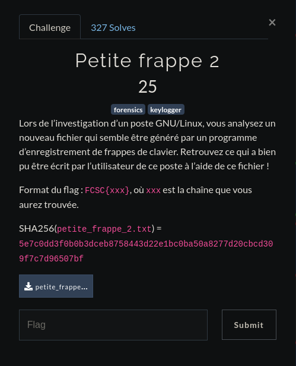

# <center>Petite Frappe 2</center>

<center>


</center>
Donc on arrive sur un fichier contenant cela 

    key press   46 
    key release 46 
    key press   24 
    key press   65 
    key release 24 
    key release 65 
    key press   39 
    key release 39 
    key press   32 
    key release 32 
    key press   46 
    key release 46 
    key press   30 
    key release 30 
    key press   28 
    key release 28 
    key press   31 
    key release 31 
    key press   32 
    key release 32 
    key press   57 
    key release 57 
    key press   65 
    key release 65 
    key press   24 
    key release 24 
    key press   55 
    key release 55 
    key press   26 
    key release 26 
    key press   54 
    key press   65 
    key release 54 
    key release 65 
    key press   53 
    key release 53 
    key press   31 
    key release 31 
    key press   57 
    key release 57 
    key press   33 
    key release 33 
    key press   30 
    key release 30 
    key press   28 
    key release 28 
    key press   65 
    key release 65 
    key press   57 
    key release 57 
    key press   26 
    key press   65 
    key release 26 
    key release 65 
    key press   39 
    key release 39 
    key press   26 
    key release 26 
    key press   47 
    key release 47 
    key press   56 
    key release 56 
    key press   46 
    key release 46 
    key press   26 
    key press   65 
    key release 26 
    key release 65 
    key press   33 
    key release 33 
    key press   24 
    key release 24 
    key press   39 
    key press   65 
    key release 39 
    key release 65 
    key press   39 
    key release 39 
    key press   30 
    key release 30 
    key press   33 
    key release 33 
    key press   26 
    key release 26 
    key press   27 
    key release 27 
    key press   65 
    key release 65 
    key press   33 
    key release 33 
    key press   27 
    key release 27 
    key press   24 
    key release 24 
    key press   28 
    key release 28 
    key press   31 
    key release 31 
    key press   38 
    key release 38 
    key press   30 
    key release 30 
    key press   26 
    key release 26 
    key press   65 
    key release 65 
    key press   24 
    key press   65 
    key release 24 
    key release 65 
    key press   40 
    key press   26 
    key release 40 
    key release 26 
    key press   54 
    key release 54 
    key press   32 
    key release 32 
    key press   40 
    key release 40 
    key press   26 
    key release 26 
    key press   27 
    key release 27 
    key press   62 
    key press   59 
    key release 59 
    key release 62 
    key press   65 
    key release 65 
    key press   46 
    key release 46 
    key press   26 
    key press   65 
    key release 26 
    key release 65 
    key press   41 
    key release 41 
    key press   46 
    key release 46 
    key press   24 
    key release 24 
    key press   42 
    key release 42 
    key press   65 
    key release 65 
    key press   26 
    key release 26 
    key press   39 
    key release 39 
    key press   28 
    key release 28 
    key press   65 
    key release 65 
    key press   30 
    key release 30 
    key press   57 
    key release 57 
    key press   17 
    key release 17 
    key press   54 
    key release 54 
    key press   46 
    key release 46 
    key press   24 
    key release 24 
    key press   55 
    key release 55 
    key press   31 
    key release 31 
    key press   26 
    key release 26 
    key press   27 
    key release 27 
    key press   17 
    key release 17 
    key press   24 
    key release 24 
    key press   25 
    key release 25 
    key press   26 
    key release 26 
    key press   27 
    key release 27 
    key press   28 
    key release 28 
    key press   29 
    key release 29 
    key press   17 
    key release 17 
    key press   26 
    key release 26 
    key press   57 
    key release 57 
    key press   17 
    key release 17 
    key press   55 
    key release 55 
    key press   24 
    key release 24 
    key press   30 
    key release 30 
    key press   28 
    key release 28 
    key press   17 
    key release 17 
    key press   40 
    key release 40 
    key press   26 
    key release 26 
    key press   30 
    key release 30 
    key press   53 
    key release 53

J'ai alors juste eu à utiliser un petit script en python qui ressemble à ça : 

```python

    with open("petite_frappe_2.txt", "r") as fd:
    content = fd.readlines()

    chars = {46: "l", 24:"a", 65:" ", 39:"s", 32:"o", 30:"u", 28:"t", 31:"i",   57:"n", 55:"v", 26:"e", 54:"c", 53:"x", 33:"p", 47:"m", 56:"b",
        27:"r", 38:"q", 40:"d", 59:".", 41:"f", 42:"g", 17:"_", 25:"z",     29:"y"}

    pressed = []
    released = []
    out = ""
    for line in content:
        line = line.strip()
        num = int(line[-2:])
        if num == 62:
            continue
        line = line[:-3]

        if line.startswith("press"): #startswitch
            if not num in chars.keys():
                print("Passing " + str(num))
            pressed.append(num)
            out += chars[num]
        elif line.startswith("release"):
            if num in pressed:
               pass
            else:
                ValueError(line)
        else:
            raise ValueError(line)

    print(out)
```

J'ai par contre dû enlever tous les "key" du fichier initiale ce qui donnait ceci :

    press   46
    release 46
    press   24
    press   65
    release 24
    release 65
    press   39
    release 39
    press   32
    release 32
    press   46
    release 46
    press   30
    release 30
    press   28
    release 28
    press   31
    release 31
    press   32
    release 32
    press   57
    release 57
    press   65
    release 65
    press   24
    release 24
    press   55
    release 55
    press   26
    release 26
    press   54
    press   65
    release 54
    release 65
    press   53
    release 53
    press   31
    release 31
    press   57
    release 57
    press   33
    release 33
    press   30
    release 30
    press   28
    release 28
    press   65
    release 65
    press   57
    release 57
    press   26
    press   65
    release 26
    release 65
    press   39
    release 39
    press   26
    release 26
    press   47
    release 47
    press   56
    release 56
    press   46
    release 46
    press   26
    press   65
    release 26
    release 65
    press   33
    release 33
    press   24
    release 24
    press   39
    press   65
    release 39
    release 65
    press   39
    release 39
    press   30
    release 30
    press   33
    release 33
    press   26
    release 26
    press   27
    release 27
    press   65
    release 65
    press   33
    release 33
    press   27
    release 27
    press   24
    release 24
    press   28
    release 28
    press   31
    release 31
    press   38
    release 38
    press   30
    release 30
    press   26
    release 26
    press   65
    release 65
    press   24
    press   65
    release 24
    release 65
    press   40
    press   26
    release 40
    release 26
    press   54
    release 54
    press   32
    release 32
    press   40
    release 40
    press   26
    release 26
    press   27
    release 27
    press   62
    press   59
    release 59
    release 62
    press   65
    release 65
    press   46
    release 46
    press   26
    press   65
    release 26
    release 65
    press   41
    release 41
    press   46
    release 46
    press   24
    release 24
    press   42
    release 42
    press   65
    release 65
    press   26
    release 26
    press   39
    release 39
    press   28
    release 28
    press   65
    release 65
    press   30
    release 30
    press   57
    release 57
    press   17
    release 17
    press   54
    release 54
    press   46
    release 46
    press   24
    release 24
    press   55
    release 55
    press   31
    release 31
    press   26
    release 26
    press   27
    release 27
    press   17
    release 17
    press   24
    release 24
    press   25
    release 25
    press   26
    release 26
    press   27
    release 27
    press   28
    release 28
    press   29
    release 29
    press   17
    release 17
    press   26
    release 26
    press   57
    release 57
    press   17
    release 17
    press   55
    release 55
    press   24
    release 24
    press   30
    release 30
    press   28
    release 28
    press   17
    release 17
    press   40
    release 40
    press   26
    release 26
    press   30
    release 30
    press   53
    release 53

On a alors plus qu'à lancer le script :

    root@PC:/home/saymant/Desktop/Bureau/FCSC/Write up/Forensic/Petite Frappe/2# python script.py 
    la solution avec xinput ne semble pas super pratique a decoder. le flag est un_clavier_azerty_en_vaut_deux
