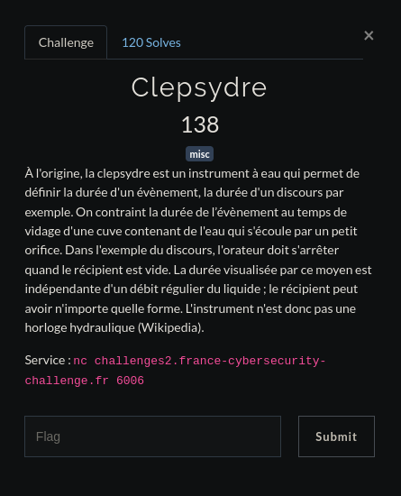

# Clepsydre

Vu la description et tous les "PRENDS TON TEMPS" qu'on aura pu voir sur le discord x), on peut se dire qu'il s'agit d'une Time based, alors juste essayer chaque charactère un à un afin de voir là où la requête prend un peu plus de temps (sleep de une seconde donc ça se voit à l'oeil nu), à chaque nouveau caractère correct la requête prendra une seconde de plus.

Personnellement je lai fait à la main (honte à moi), mais on pouvait très bien et même plus facilement le faire en scriptant.

Finalement on devrait arriver à un mot de passe comme celui-ci : T3mp#!

    $ nc challenges2.france-cybersecurity-challenge.fr 6006
    [Citation du jour] : "Tout vient à point à qui sait attendre".

    Entrez votre mot de passe : T3mp#!

    Félicitations vous avez su vaincre votre impatience : 

    FCSC{6bdd5f185a5fda5ae37245d355f757eb0bbe888eea004cda16cf79b2c0d60d32}

Done ;)