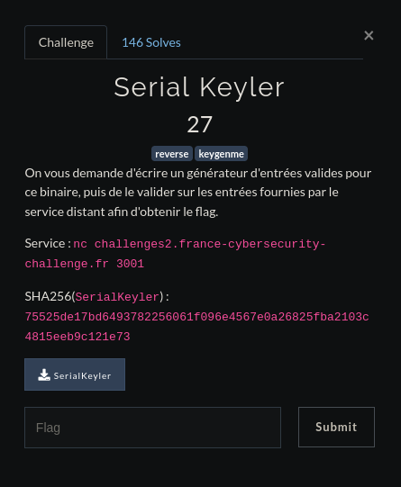

# <center>SerialKeyler</center>

<center>


</center>

On va d'abord essayer de regarder un peu ce qu'il se passe au niveau du programme en local.
<br>
<br>
Et si on essayait de le lancer ?

    saymant@PC:~/Desktop/Bureau/FCSC/Write up/RE/SerialKeyler$ ./SerialKeyler 
    [+] Username: saymant
    [+] Serial:   test
    [!] Incorrect serial.

Bon jusque là rien d'anormal, le programme nous demande un pseudo et un serial pour ce pseudo et va vérifier si il est correct.

Bon on va quand même le lancer avec [ltrace]('http://man7.org/linux/man-pages/man1/ltrace.1.html') pour voir ce qu'il se passe lors de l'execution.

    saymant@PC:~/Desktop/Bureau/FCSC/Write up/RE/SerialKeyler$ ltrace ./SerialKeyler 
    printf("[+] Username: ")                               = 14
    __isoc99_scanf(0x558b395e8a57, 0x7ffc49153e60, 0x7f1093598760, 0xfbad2a84[+] Username: saymant
    ) = 1
    printf("[+] Serial:   ")                               = 14
    __isoc99_scanf(0x558b395e8a57, 0x7ffc49153ea0, 0x7f1093598760, 0x2020203a6c616972[+] Serial:   test
    ) = 1
    strlen("saymant")                                      = 7
    memset(0x7ffc49153e00, '\0', 64)                       = 0x7ffc49153e00
    strcmp("test", "kq~rf~l")                              = 9
    puts("[!] Incorrect serial."[!] Incorrect serial.
    )                          = 22
    +++ exited (status 0) +++

Ici on peut voir que la serial que l'on a entré va être comparée avec la string 'kq~rf~l' qui est ici le bon serial, essayons de rentrer un autre username pour voir ce qu'il se passe.

    saymant@PC:~/Desktop/Bureau/FCSC/Write up/RE/SerialKeyler$ ltrace ./SerialKeyler 
    printf("[+] Username: ")                                                                     = 14
    __isoc99_scanf(0x555d9788aa57, 0x7ffe8b852d40, 0x7f43785a6760, 0xfbad2a84[+] Username: azerty
    )                   = 1
    printf("[+] Serial:   ")                                                                     = 14
    __isoc99_scanf(0x555d9788aa57, 0x7ffe8b852d80, 0x7f43785a6760, 0x2020203a6c616972[+] Serial:   qwerty
    )           = 1
    strlen("azerty")                                                                             = 6
    memset(0x7ffe8b852ce0, '\0', 64)                                                             = 0x7ffe8b852ce0
    strcmp("qwerty", "fkmze~")                                                                   = 11
    puts("[!] Incorrect serial."[!] Incorrect serial.
    )                                                                = 22
    +++ exited (status 0) +++

Le serial a encore changé, on peut donc en déduire qu'il va varier en fonction de l'username que l'on rentre et vu à quoi les serials ressemblent on peut également en déduire qu'il va s'agir d'un xor. Je me suis alors aidé de [CyberChef]('https://gchq.github.io/CyberChef/') pour bruteforce la clé de chiffrement. Finalement à une ligne on trouve ```Key = 1f: ytreza```, sachant que notre username de base était 'azerty', la clé est donc de 1f soit 31. Mais ici note string est inversée, cela veut dire que l'ordre des lettres de notre username est d'abord inversé, puis celle-ci est xor avec une clé de 31.

Parfait ! Maintenant nous avons tout ce qu'il nous faut pour faire notre Keygen, celui que nous utiliserons ici est en python et ressemble à ça :

```python
    import socket,time

    HOSTNAME = "challenges2.france-cybersecurity-challenge.fr"
    PORT = 3001
    sock = socket.socket(socket.AF_INET, socket.SOCK_STREAM)
    sock.connect((HOSTNAME, PORT))
    answer=''
    i=0
    msg = sock.recv(1024)
    str = msg.decode().split(": ")[1].partition('\n')[0]
    print(str)

    for y in str:
            answer = answer[0:i] + chr(ord(y)^31)
            i+=1
    print(answer[::-1])
    sock.sendall(answer[::-1].encode() + b'\n')


    for z in range(100):
            answer=''
            i=0
            msg = sock.recv(1024)
            print("Message reçu : " + msg.decode())
            str = msg.decode().split(": ")[1].partition('\n')[0]
            for y in str:
                    answer = answer[0:i] + chr(ord(y)^31)
                    i+=1
            print("Réponse : " + answer[::-1])
            sock.sendall(answer[::-1].encode() + b'\n')
            time.sleep(1)
    sock.close() 
```

Brièvement ce que fait ce script c'est qu'il va attendre de recevoir quelque chose du serveur, une fois reçu il va juste prendre la valeure qui se situe après ': ' (C'est l'username que donne le serveur car les messages sont comme ceci : <br>"What is a valid serial for username: blablabla
<br>\>\>> la_serial_qu'on_va_mettre" )
<br>
Ensuite il va xor et invérser l'ordre des charactères de notre serial et recommencer 100x la manipulation (C'est un nombre plus important que le nombre réel de fois à répeter cette manip car on ne sait pas exactement combien de fois il faudra la recommencer)

Bien à présent nous pouvons essayer notre keygen.

    saymant@PC:~/Desktop/Bureau/FCSC/Write up/RE/SerialKeyler$ python3 key.py 
    ecsc
    |l|z
    Message reçu : What is a valid serial for username: ANSSI

    Réponse : VLLQ^
    Message reçu : >>> What is a valid serial for username: HelloWorld
    >>> 
    Réponse : {smpHpsszW
    Message reçu : What is a valid serial for username: TeamFrance
    >>> 
    Réponse : z|q~mYr~zK
    Message reçu : What is a valid serial for username: #ECSC #TeamFR
    >>> 
    Réponse : MYr~zK<?\L\Z<
    Message reçu : What is a valid serial for username: Robert Romero
    >>> 
    Réponse : pmzrpM?kmz}pM
    Message reçu : What is a valid serial for username: Edward Rockmore
    >>> 
    Réponse : zmprt|pM?{m~h{Z
    
    ...

    Message reçu : Well done! Here is the flag: FCSC{8f1018d0cfe395018a1c90dbff352e2ba4a6261336fb7c32454cdae4974d4333}

    Réponse : b,,,+{+(&+z~{|+*+-,|(}y),,.)-)~+~}-z-*,yy}{/&|.~'./*&,zy|/{'./.y'd\L\Y

Bingo ! Notre flag
