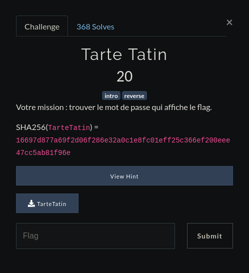

# 
Tarte Tatin

Donc on nous donne un binaire à RE, et si on le lancait ?

      saymant@PC:~/Desktop/Bureau/FCSC/Write up/RE/Tarte Tatin$ ./TarteTatin 
      test
      saymant@PC:~/Desktop/Bureau/FCSC/Write up/RE/Tarte Tatin$ 

D'accord donc le programme nous laisse juste écrire du texte puis se referme aussitôt.
 
Désassemblons le pour voir de plus près ce qu'il fait.

    pwndbg> disass main
    Dump of assembler code for function main:
       0x00000000000007a4 <+0>:	push   rbp
       0x00000000000007a5 <+1>:	mov    rbp,rsp
       0x00000000000007a8 <+4>:	sub    rsp,0x30
       0x00000000000007ac <+8>:	mov    rax,QWORD PTR fs:0x28
       0x00000000000007b5 <+17>:	mov    QWORD PTR [rbp-0x8],rax
       0x00000000000007b9 <+21>:	xor    eax,eax
       0x00000000000007bb <+23>:	mov    rdx,QWORD PTR [rip   +0x2008ce]        # 0x201090 <stdin@@GLIBC_2.2.5>
       0x00000000000007c2 <+30>:	lea    rax,[rbp-0x30]
       0x00000000000007c6 <+34>:	mov    esi,0x20
       0x00000000000007cb <+39>:	mov    rdi,rax
       0x00000000000007ce <+42>:	call   0x650 <fgets@plt>
       0x00000000000007d3 <+47>:	lea    rax,[rbp-0x30]
       0x00000000000007d7 <+51>:	mov    rdi,rax
       0x00000000000007da <+54>:	call   0x77a <transform>
       0x00000000000007df <+59>:	lea    rax,[rbp-0x30]
       0x00000000000007e3 <+63>:	mov    edx,0x10
       0x00000000000007e8 <+68>:	lea    rsi,[rip +0x200891]        # 0x201080 <pass_enc>
       0x00000000000007ef <+75>:	mov    rdi,rax
       0x00000000000007f2 <+78>:	call   0x640 <memcmp@plt>
       0x00000000000007f7 <+83>:	test   eax,eax
       0x00000000000007f9 <+85>:	jne    0x81a <main+118>
       0x00000000000007fb <+87>:	lea    rdi,[rip +0x20081e]        # 0x201020 <flag_enc>
       0x0000000000000802 <+94>:	call   0x77a <transform>
       0x0000000000000807 <+99>:	lea    rdi,[rip +0x200812]        # 0x201020 <flag_enc>
       0x000000000000080e <+106>:	call   0x620 <puts@plt>
       0x0000000000000813 <+111>:	mov    eax,0x1
       0x0000000000000818 <+116>:	jmp    0x81f <main+123>
       0x000000000000081a <+118>:	mov    eax,0x0
       0x000000000000081f <+123>:	mov    rcx,QWORD PTR [rbp-0x8]
       0x0000000000000823 <+127>:	xor    rcx,QWORD PTR fs:0x28
       0x000000000000082c <+136>:	je     0x833 <main+143>
       0x000000000000082e <+138>:	call   0x630    <__stack_chk_fail@plt>
       0x0000000000000833 <+143>:	leave  
       0x0000000000000834 <+144>:	ret    
    End of assembler dump.
    
Donc on peut voir que le programme va demander une entrée clavier avec fgets, ensuite appeler la fonction transform et va comparer avec memcmp la valeur que l'on a rentré avec le flag sûrement.
 
Bien voyons voir ce que fait exactement cette fonction *transform* :

    Dump of assembler code for function transform:
       0x000000000000077a <+0>:	push   rbp
       0x000000000000077b <+1>:	mov    rbp,rsp
       0x000000000000077e <+4>:	mov    QWORD PTR [rbp-0x8],rdi
       0x0000000000000782 <+8>:	mov    rax,QWORD PTR [rbp-0x8]
       0x0000000000000786 <+12>: lea    rdx,[rax+0x1]
       0x000000000000078a <+16>: mov    QWORD PTR [rbp-0x8],rdx
       0x000000000000078e <+20>: movzx  edx,BYTE PTR [rax]
       0x0000000000000791 <+23>: add    edx,0x1
       0x0000000000000794 <+26>: mov    BYTE PTR [rax],dl
       0x0000000000000796 <+28>: mov    rax,QWORD PTR [rbp-0x8]
       0x000000000000079a <+32>: movzx  eax,BYTE PTR [rax]
       0x000000000000079d <+35>: test   al,al
       0x000000000000079f <+37>: jne    0x782 <transform+8>
       0x00000000000007a1 <+39>: nop
       0x00000000000007a2 <+40>: pop    rbp
       0x00000000000007a3 <+41>: ret    
    End of assembler dump.

À vu d'oeil cette fonction est sensé incrémenter de 1 les caractères de la string que l'on va entrer.
 
Pour confirmer cela mettons un breakpoint à l'appel de cette fonction à 0x0000000000000802 et un après l'appel de celle-ci à 0x00000000000007a3.
Tant qu'on y est mettons aussi un breakpoint sur le memcmp à 0x00000000000007f2 pour essayer de voir avec quelle valeure est comparée notre string.
Lançons l'executable avec comme argument "AAA"
  
Avant d'appeler la fonction transform, notre stack ressemble à ça :

     RAX  0x7fffffffcc90 ◂— 0xa414141 /* 'AAA\n' */
     RBX  0x0
     RCX  0xfbad2288
     RDX  0x7fffffffcc90 ◂— 0xa414141 /* 'AAA\n' */
     RDI  0x7fffffffcc91 ◂— 0xa4141 /* 'AA\n' */
     RSI  0x7ffff7dd5770 (_IO_stdfile_0_lock) ◂— 0x0
     R8   0x555555756014 ◂— 0x0
     R9   0x7ffff7fd5700 ◂— 0x7ffff7fd5700
     R10  0x7ffff7dd3b58 (main_arena+88) —▸ 0x555555756410 ◂— 0x0
     R11  0x246
     R12  0x555555554670 (_start) ◂— xor    ebp, ebp
     R13  0x7fffffffcda0 ◂— 0x1
     R14  0x0
     R15  0x0
     RBP  0x7fffffffccc0 —▸ 0x555555554840 (__libc_csu_init) ◂— push   r15
     RSP  0x7fffffffcc90 ◂— 0xa414141 /* 'AAA\n' */
     RIP  0x5555555547d7 (main+51) ◂— mov    rdi, rax

On voit donc que notre argument "AAA" a été mis sur le haut de la stack. Continuons

     RAX  0x7fffffffcc90 ◂— 0xb424242 /* 'BBB\x0b' */
     RBX  0x0
     RCX  0xfbad2288
     RDX  0xb
     RDI  0x7fffffffcc90 ◂— 0xb424242 /* 'BBB\x0b' */
     RSI  0x7ffff7dd5770 (_IO_stdfile_0_lock) ◂— 0x0
     R8   0x555555756014 ◂— 0x0
     R9   0x7ffff7fd5700 ◂— 0x7ffff7fd5700
     R10  0x7ffff7dd3b58 (main_arena+88) —▸ 0x555555756410 ◂— 0x0
     R11  0x246
     R12  0x555555554670 (_start) ◂— xor    ebp, ebp
     R13  0x7fffffffcda0 ◂— 0x1
     R14  0x0
     R15  0x0
     RBP  0x7fffffffccc0 —▸ 0x555555554840 (__libc_csu_init) ◂— push   r15
     RSP  0x7fffffffcc90 ◂— 0xb424242 /* 'BBB\x0b' */
     RIP  0x5555555547e3 (main+63) ◂— mov    edx, 0x10

Notre "AAA" qui était sur le sommet de notre stack a été remplacé par un BBB. Cela veut dire que la fonction transform se contente d'incrémenter de 1 chaque charactère de l'argument que l'on passe.
Continuons encore, et au niveau du memcmp :

     RAX  0x7fffffffcc90 ◂— 0xb424242 /* 'BBB\x0b' */
     RBX  0x0
     RCX  0xfbad2288
     RDX  0x10
     RDI  0x7fffffffcc90 ◂— 0xb424242 /* 'BBB\x0b' */
     RSI  0x555555755080 (pass_enc) ◂— 0x3473766466547a4e ('NzTfdvs4')
     R8   0x555555756014 ◂— 0x0
     R9   0x7ffff7fd5700 ◂— 0x7ffff7fd5700
     R10  0x7ffff7dd3b58 (main_arena+88) —▸ 0x555555756410 ◂— 0x0
     R11  0x246
     R12  0x555555554670 (_start) ◂— xor    ebp, ebp
     R13  0x7fffffffcda0 ◂— 0x1
     R14  0x0
     R15  0x0
     RBP  0x7fffffffccc0 —▸ 0x555555554840 (__libc_csu_init) ◂—     push   r15
     RSP  0x7fffffffcc90 ◂— 0xb424242 /* 'BBB\x0b' */
     RIP  0x5555555547f2 (main+78) ◂— call   0x555555554640

On voit qu'une nouvelle valeure s'est ajoutée sur la stack, cela veut dire que notre valeur BBB est comparée avec celle-ci.
Essayons de mettre cette valeur comme argument dans l'executable. Mais le seul problème est que nos caractères seront incrementés une fois le programme lancé.
 
Alors nous avons juste à faire un petit script en python qui va décrémenter chaque lettre de notre string, celui-ci devrait ressembler à ça :

    string= "NzTfdvs4"
    t = []

    for c in string:
      t.append(chr(ord(c)-1))

    final = "".join(t)

    print(final)

L'output est : MySecur3
  
On test de rentrer cela

   saymant@PC:~/Desktop/Bureau/FCSC/Write up/RE/Tarte Tatin$ ./TarteTatin 
    MySecur3

Mais rien ne se passe ... On peut donc alors de là en déduire que 'NzTfdvs4' n'était alors que le début de la string, vu que nous sommes sur du 64 bits les registres sont donc sur 8 octets et donc le registre RSI ici n'a pût stocker que les 8 premiers octets de notre string.
 
Pour voir la suite, on a juste à faire un 

    saymant@PC:~/Desktop/Bureau/FCSC/Write up/RE/Tarte Tatin$ strings TarteTatin
    /lib64/ld-linux-x86-64.so.2
    ~NzzA.
    Lf\R
    libc.so.6
    puts
    __stack_chk_fail
    stdin
    fgets
    memcmp
    __cxa_finalize
    __libc_start_main
    GLIBC_2.4
    GLIBC_2.2.5
    _ITM_deregisterTMCloneTable
    __gmon_start__
    _ITM_registerTMCloneTable
    %z	 
    =a	 
    AWAVI
    AUATL
    []A\A]A^A_
    ;*3$"
    Vdkk
    cnmd 
    ek`f
    EBRBz72e30320b000/51c//2cc/102be713c55e66/`/ad02/4d1702e04cc654/    2`80c|
    NzTfdvs4Q4ttx1seGCC: (Ubuntu 7.5.0-3ubuntu1~18.04) 7.5.0
    ...

Nous arrivons donc à voir une string dont le début ressemble fortement à celle que nous avions juste avant, on retire le 'GCC' à la fin qui définit juste le compilateur et nous avons notre string (NzTfdvs4Q4ttx1se).
  
Bien, maintenant réessayons d'appliquer notre script en modifiant la valeure de 'string' ce qui donne :

    string= "NzTfdvs4Q4ttx1se"
    t = []

    for c in string:
      t.append(chr(ord(c)-1))

    final = "".join(t)

    print(final)

Executons le 

    saymant@PC:~/Desktop/Bureau/FCSC/Write up/RE/Tarte Tatin$ python exploit.py 
    MySecur3P3ssw0rd

Bingo, et si on le testait dans le programme maintenant ?

    saymant@PC:~/Desktop/Bureau/FCSC/Write up/RE/Tarte Tatin$ ./TarteTatin 
    MySecur3P3ssw0rd
    Well done! The flag is: FCSC{83f41431c111062d003dd0213cf824d66f770a0be1305e2813f15dd76503a91d}

:)
