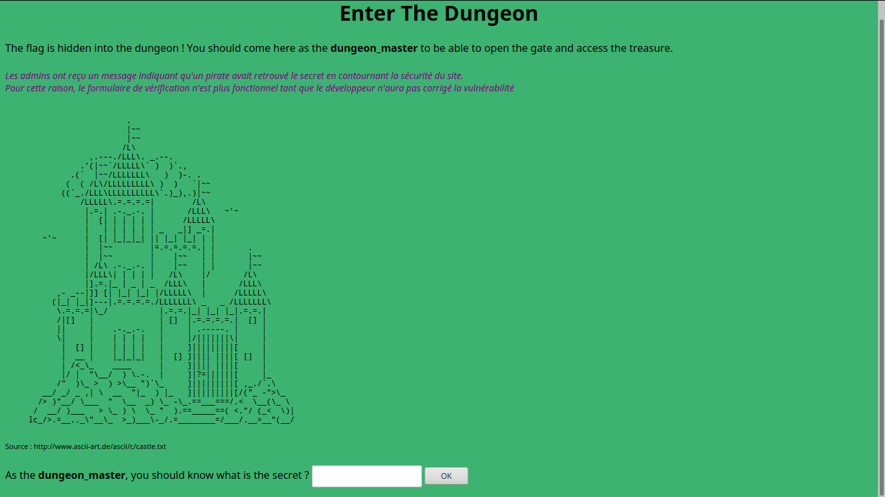
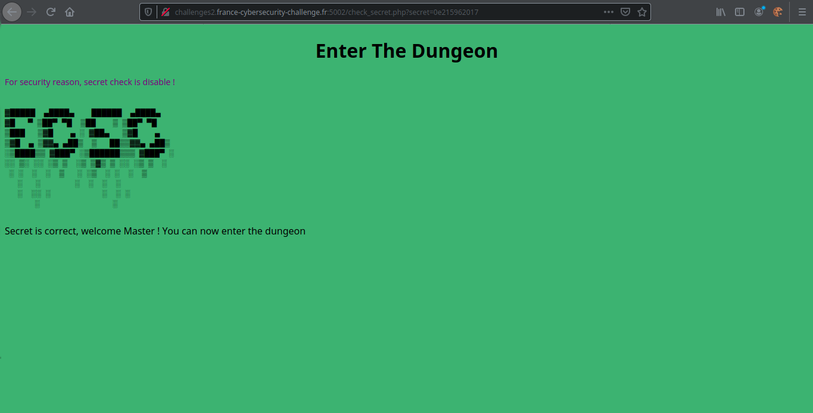

# <center><b>EnterTheDungeon</b></center>
</br>
<blockquote> On vous demande simplement de trouver le flag. </blockquote>
</br>
Donc on arrive sur cette page



On nous demande un secret afin d'entrer dans le donjon.
</br>
On essaye alors un input bidon, toto.


Évidemment ...
<br>
Mais par contre on peut voir que /?check_secret.php à été ajouté à notre url avec comme paramètre notre input qui ici est toto. Assez intéressant, revenons à notre index et allons check du côté du code source maintenant !

```html
    <html> 
    <head>
	<title>Enter The Dungeon</title>
    </head>
    <body style="background-color:#3CB371;">
    <center><h1>Enter The Dungeon</h1></center>
    The flag is hidden into the dungeon ! You should come here as the <b>dungeon_master</b> to be able to open the gate and access the treasure.<br /><br />

    <!-- Pour les admins : si vous pouvez valider les changements que j'ai fait dans la page "check_secret.php", le code est accessible sur le fichier "check_secret.txt" -->
    <div style="font-size:85%;color:purple"><i>Les admins ont reçu un message indiquant qu'un pirate avait retrouvé le secret en contournant la sécurité du site. <br />Pour cette raison, le formulaire de vérification n'est plus fonctionnel tant que le développeur n'aura pas corrigé la vulnérabilité</i></div><br />

    <pre>
                          .
                          |~~
                          |~~
                         /L\
                  ,.---./LLL\. _.--.
                .'(|~~`/LLLLL\` )  )`.,
              .(`  |~~/LLLLLLL\   )  )-. .
             (  ( /L\/LLLLLLLLL\ )  )   `|~~
            ((`_./LLL\LLLLLLLLLL\`.)_),.)|~~
                /LLLLL\.=.=.=.=|        /L\
                 |.=.| .-._.-. |       /LLL\   ~'~
                 |  [| | | | | |      /LLLLL\
                 |   | | | | | | _   _|] _=.|
        ~'~      |  [| |_|_|_| || |_| |_| | |
                 |  |~~        |=.=.=.=.=.| |       .
                 |  |~~        |    |~~   | |       |~~
                 | /L\ .-._.-. |    |~~   | |       |~~
                 |/LLL\| | | | |   /L\    |/       /L\
                 |].=.|_ | _ | _  /LLL\   |       /LLL\
           ,- _--|]] [| |_| |_| |/LLLLL\  |      /LLLLL\
          (|_| |_|]---|.=.=.=.=./LLLLLLL\ _   _ /LLLLLLL\
           \.=.=.=|\_/           |.=.=.|_| |_| |_|.=.=.|
           /|[]   |              | []  |.=.=.=.=.|  [] |
           ||     |    .-._.-.   |     | .-----. |     |
           \|     |    | | | |   |     |/|||||||\|     |
            |  [] |    | | | |   |     ]|||||||||[     |
            |  __ |    |_|_|_|   |  [] ]|||| ||||[ []  |
            | /<_\_    ____      |     ]|||| ||||[     |
            |/ |  "\__/  ) \.-.  |     ]|?=||||||[     |_
           /"  )\_ >  ) >\__ ")`\_     ]|||||||||[ ,_./`.\
        __/ _/ _ ,| \  __  "|_  ) |_   ]|||||||||[/("_ -">\_
       /> )"__/ \___  "  \__  _) \_ -\_.==___===/.<  \__(\_ \
      /  __/ )___   > \_ ) \  \_ "  ).==_____==( <."/ (_<  \)|
     lc_/>.=__.._\"__\_  >_)___\-_/.=________=/___/.__>__"(__/

    </pre>
    <div style="font-size:70%">Source : http://www.ascii-art.de/ascii/c/castle.txt</div><br />
    <form method="GET" action="check_secret.php">
    As the <b>dungeon_master</b>, you should know what is the secret ? <input name="secret" /> <input type="submit" value="OK" />
    </form>
    </body>
    </html>
```
Le commentaire à ici l'air intéressant, allons voir le check_secret.txt.

```php
    <?php
	    session_start();
	    $_SESSION['dungeon_master'] = 0;
    ?>
    <html>
    <head>
	    <title>Enter The Dungeon</title>
    </head>
    <body style="background-color:#3CB371;">
    <center><h1>Enter The Dungeon</h1></center>
    <?php
	    echo '<div style="font-size:85%;color:purple">For security reason, secret check is disable !</div><br />';
	    echo '<pre>'.chr(10);
	    include('./ecsc.txt');
	    echo chr(10).'</pre>';

	    // authentication is replaced by an impossible test
	    //if(md5($_GET['secret']) == "a5de2c87ba651432365a5efd928ee8f2")
	    if(md5($_GET['secret']) == $_GET['secret'])
	    {
		    $_SESSION['dungeon_master'] = 1;
		    echo "Secret is correct, welcome Master ! You can now enter the dungeon";
		
	    }
	    else
	    {
		    echo "Wrong secret !";
	    }
    ?>
```

Ah oui ... Le challenge prend alors tout son sens, si on regarde la condition ci-dessous...

```php
        if(md5($_GET['secret']) == $_GET['secret'])
    {
	    $_SESSION['dungeon_master'] = 1;
	    echo "Secret is correct, welcome Master ! You can now enter the dungeon";
	
    }
```

Nous pouvons voir que nous avons affaire à une condition **impossible** afin que nous n'arrivions jamais à entrer dans le donjon car effectivement, un mot, un nombre, ou quoi que ce soit ne peut pas être égal à son hash md5. Vraiment ?

Et bien en réalité pas vraiment, nous avons ici affaire à une *Loose comparison*. La faille va ici consister à mettre en input une valeur qui commence par *0e* et dont le hash md5 aussi commence également par *0e*.
<br>
Vous allez me dire "Mais pourquoi par 0e ?", et bien tout simplement car en mettant '0e' les valeurs mises après le '0' ne seront pas prises en compte lors de la comparaison.
<br>
En cherchant un peu dans les Magic Hashes (Regroupant les valeurs dont j'ai parlé) on trouve finalement une valeur qui marche : *0e215962017* et dont le hash sera donc *0e291242476940776845150308577824*


<br>
Nous n'avons plus qu'à retourner sur l'index et bingo ! 
<br>

    Félicitation Maître, voici le flag : FCSC{f67aaeb3b15152b216cb1addbf0236c66f9d81c4487c4db813c1de8603bb2b5b}
