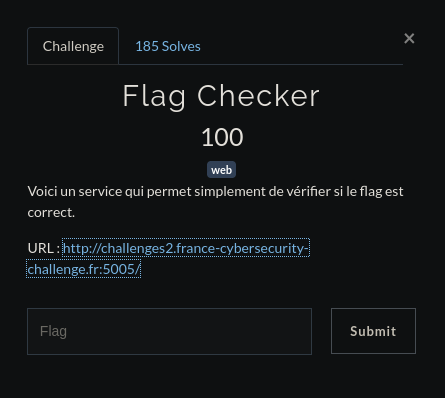

# <center>Flag Checker</center>

<center>



</center>

On arrive sur cette page


Commençons par regarder les sources


L'index.js ne donne rien d'intéressant à exploiter, par contre penchons nous plus sur l'index.wasm, il peut être intéressant.

  
  ```wasm
    (module
      (type $type0 (func (param i32) (result i32))  )
      (type $type1 (func))
      (type $type2 (func (param i32)))
      (type $type3 (func (result i32)))
      (import "a" "memory" (memory $memory0 256     256))
      (global $global0 (mut i32) (i32.const     5244480))
      (export "a" (func $func5))
      (export "b" (func $func4))
      (export "c" (func $func2))
      (export "d" (func $func1))
      (export "e" (func $func0))
      (func $func0 (param $var0 i32)
        get_local $var0
        set_global $global0
      )
      (func $func1 (param $var0 i32) (result i32)
        get_global $global0
        get_local $var0
        i32.sub
        i32.const -16
        i32.and
        tee_local $var0
        set_global $global0
        get_local $var0
      )
      (func $func2 (result i32)
        get_global $global0
      )
      (func $func3 (param $var0 i32) (result i32)
        (local $var1 i32) (local $var2 i32)     (local $var3 i32) (local $var4 i32)     (local $var5 i32)
        i32.const 70
        set_local $var3
        i32.const 1024
        set_local $var1
        block $label0
          get_local $var0
          i32.load8_u
          tee_local $var2
          i32.eqz
          br_if $label0
          loop $label2
            block $label1
              get_local $var2
              get_local $var1
              i32.load8_u
              tee_local $var4
              i32.ne
              br_if $label1
              get_local $var3
              i32.const -1
              i32.add
              tee_local $var3
              i32.eqz
              br_if $label1
              get_local $var4
              i32.eqz
              br_if $label1
              get_local $var1
              i32.const 1
              i32.add
              set_local $var1
              get_local $var0
              i32.load8_u offset=1
              set_local $var2
              get_local $var0
              i32.const 1
              i32.add
              set_local $var0
              get_local $var2
              br_if $label2
              br $label0
            end $label1
          end $label2
          get_local $var2
          set_local $var5
        end $label0
        get_local $var5
        i32.const 255
        i32.and
        get_local $var1
        i32.load8_u
        i32.sub
      )
      (func $func4 (param $var0 i32) (result i32)
        (local $var1 i32) (local $var2 i32)
        get_local $var0
        i32.load8_u
        tee_local $var2
        if
          get_local $var0
          set_local $var1
          loop $label0
            get_local $var1
            get_local $var2
            i32.const 3
            i32.xor
            i32.store8
            get_local $var1
            i32.load8_u offset=1
            set_local $var2
            get_local $var1
            i32.const 1
            i32.add
            set_local $var1
            get_local $var2
            br_if $label0
          end $label0
        end
        get_local $var0
        call $func3
        i32.eqz
      )
      (func $func5
        nop
      )
      (data (i32.const 1024)
        "E@P@x4f1g7f6ab:42`1g:f:7763133;e0e;    03`6661`bee0:33fg732;b6fea44be34g0~"
      )
    )
```

Nous avons donc notre string tout en bas, et dans les instructions nous voyons un i32.xor, cela veut dire que notre string a été xor. Il nous suffit donc d'aller sur un XOR Bruteforcer cf https://gchq.github.io/CyberChef/#recipe=XOR_Brute_Force(1,100,0,'Standard',false,true,false,'')

On peut alors voir un ```Key = 03: FCSC{7e2d4e5ba971c2d9e944502008f3f830c5552caff3900ed4018a5efb77af07d3}```

La clé de chiffrement est donc de 3 et le flag est FCSC{7e2d4e5ba971c2d9e944502008f3f830c5552caff3900ed4018a5efb77af07d3}
