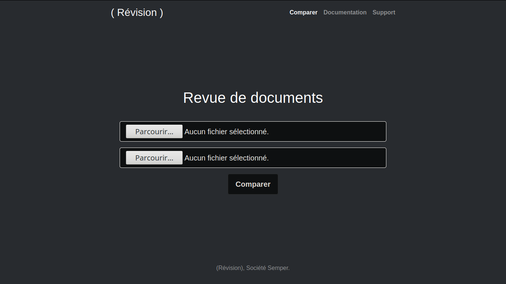
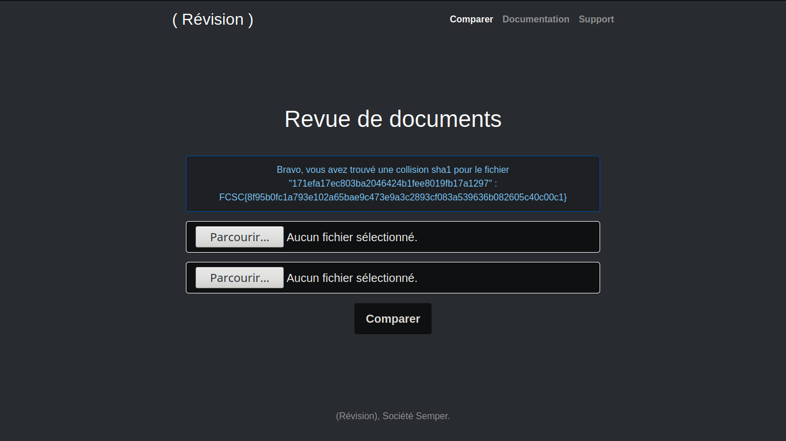

Révision

==============

<blockquote>La société Semper est spécialisée en    archivage de documents électroniques. Afin de  simplifier le travail des archivistes, un    outil simple de suivi de modification a été    mis en ligne. Depuis quelques temps    néanmoins, cet outil dysfonctionne. Les    salariés se plaignent de ne pas recevoir tous  les documents et il n'est pas rare que le    système plante. Le développeur de  l'application pense avoir identifié l'origine    du problème. Aidez-le à reproduire le bug.

Note : La taille totale des fichiers est    limitée à 2Mo.</blockquote>

Et on nous laisse avec ce script :

    # coding: utf-8
    import hashlib
    from web.services.database import Database
    from web.services.mailer import Mailer

    class ComparatorError(Exception):
        """Base class for all Comparator exceptions"""
        pass

    class DatabaseError(ComparatorError):
        """Exception raised for errors in database operations."""

    class StoreError(ComparatorError):
        """Exception raised for errors in store function.

        Attributes:
            message -- explanation of the error
        """

        def __init__(self, files, message):
            self.files = files
            self.message = message

    class Comparator(object):
        """A class for Comparator"""

        BLOCK_SIZE = 8*1024

        def __init__(self, f1=None, f2=None):
            """
            Set default parameters

            Required parameters :
                f1: open file handler
                f2: open file handler
                db: database
                m : mailer

            """
            self.f1 = f1
            self.f2 = f2
            self.db = Database()
            self.m = Mailer()

        def compare(self):
            self._reset_cursor()
            return self.f1.read() == self.f2.read()

        def store(self):
            self._reset_cursor()
            f1_hash = self._compute_sha1(self.f1)
            f2_hash = self._compute_sha1(self.f2)

            if self.db.document_exists(f1_hash) or self.db.document_exists(f2_hash) :
                raise DatabaseError()

            attachments = set([f1_hash, f2_hash])
            # Debug debug...
            if len(attachments) < 2:
                raise StoreError([f1_hash, f2_hash], self._get_flag())
            else:
                self.m.send(attachments=attachments)

        def _compute_sha1(self, f):
            h = hashlib.sha1()
            buf = f.read(self.BLOCK_SIZE)
            while len(buf) > 0:
                h.update(buf)
                buf = f.read(self.BLOCK_SIZE)
            return h.hexdigest()

        def _reset_cursor(self):
            self.f1.seek(0)
            self.f2.seek(0)

        def _get_flag(self):
            with open('flag.txt', 'r') as f:
                flag = f.read()
            return flag

Ce challenge consistait juste en une sha1 collision.
  
Il suffisait d'aller sur [un site de sha1 collider]('https://alf.nu/SHA1'), d'y insérer deux fichiers et de récuperer les fichiers de sortie. Cela se contente de mettre les fichiers en pdf avec des chaînes différentes mais le même hash, ce qui va fausser la comparaison vu que celle-ci se base sur le hash de chaque pdf.
  
Au final nous obtenons ça :
