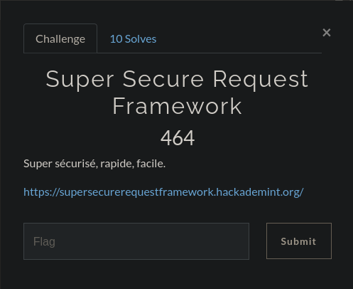
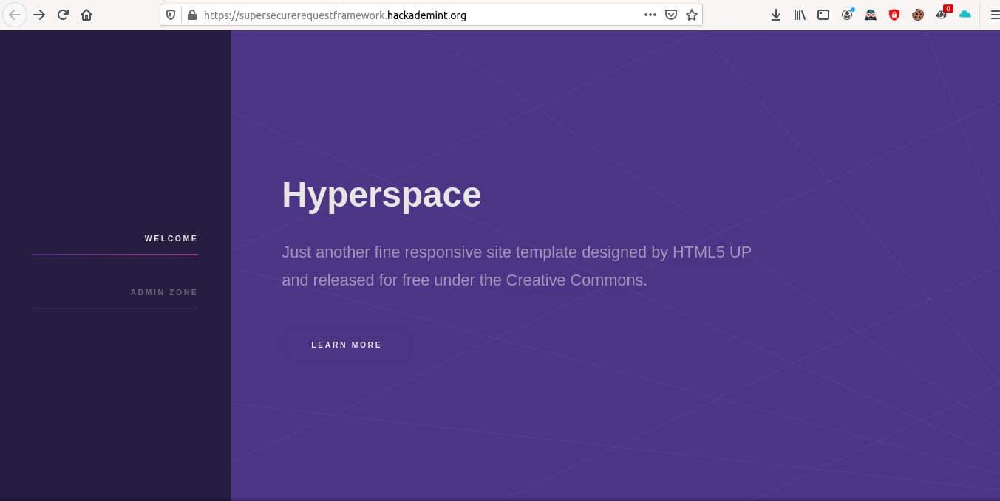
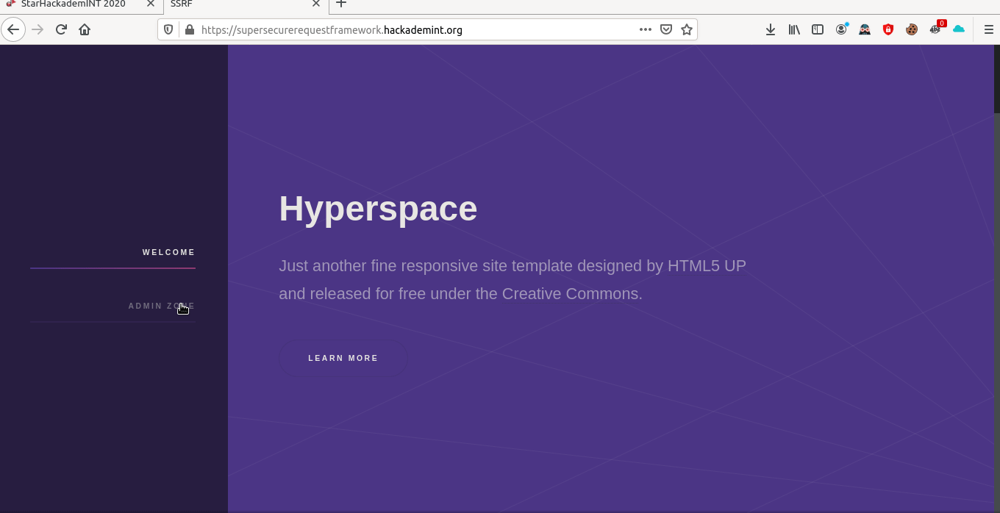
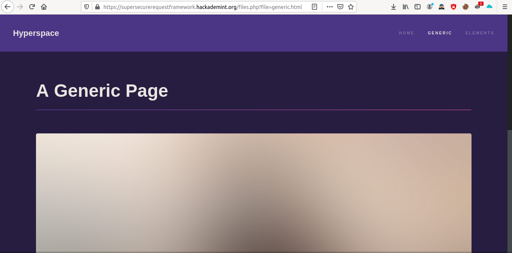
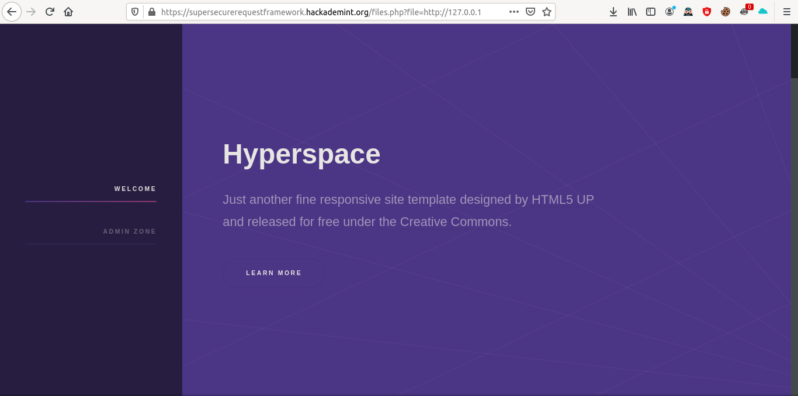
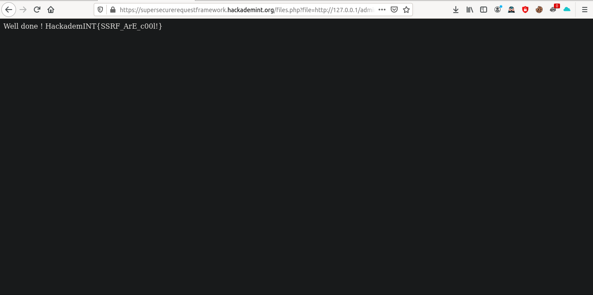

# Super Secure Request Framework 

Donc on arrive sur un site web comme ci-dessous

En naviguant un peu sur le site on s'aperçoit de plusieurs choses.

Déjà il y a une page se nommant "Admin Zone" à laquelle nous n'avons pas accès

Ensuite, partie du site contient une url suspicieuse d'être vulnérable aux attaques SSRF (vu le titre du challenge)

Le paramètre file a l'air vulnérable essayons de lui passer comme valeur `http://127.0.0.1` pour qu'au lieu de faire une requête pour demander le fichier, il va faire une requête au serveur http situé en local (ici le site sur lequel on navigue depuis la tou à l'heure)

Ok ça a l'air bon, essayons maintenant d'accéder à la page qui nous était interdit auparavant

